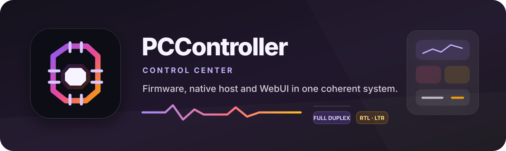
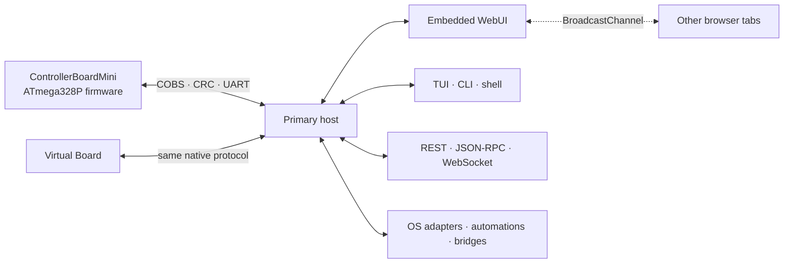

<div align="center">
  <a href="https://github.com/atomicdeploy/PCController">
    
  </a>
  <br><br>
  <a href="https://github.com/atomicdeploy/PCController"></a>
  <a href="#quick-start"></a>
  <a href="Tools/Controller/README.md#embedded-web-control-center"></a>
  <a href="Tools/Controller/docs/Protocol-and-Network-API.md"></a>
  <a href="Tools/Controller/api/reference.html"></a>
  <a href="docs/README.md"></a>
  <br><br>
  <a href="https://github.com/atomicdeploy/PCController/actions/workflows/build.yml"></a>
  <a href="https://github.com/atomicdeploy/PCController/actions/workflows/repository-health.yml"></a>
  <a href="https://github.com/atomicdeploy/PCController/actions/workflows/codeql.yml"></a>
  <a href="https://github.com/atomicdeploy/PCController/actions/workflows/update-dependencies.yml"></a>
  <a href="https://github.com/atomicdeploy/PCController/actions/workflows/release.yml"></a>
  <a href="LICENSE"></a>
  <br><br>
  
  
  
  
  
</div>

> [!IMPORTANT]
> PCController is in active pre-release development and **has no stable release
> yet**. CI artifacts are unsigned engineering builds. Build provenance proves
> where an artifact came from; it does not prove safe operation on a physical
> controller, attached load, or mechanism.

PCController is the complete control plane for ControllerBoardMini: compact
ATmega328P firmware, a native Go host, a responsive embedded WebUI, and a
hardware-free virtual board. The browser, terminal UI, CLI, automation engine,
and network APIs all use the same command dispatcher, safety rules, connection
owner, and event stream.

<p align="center">
  
  
  
  
  
</p>

## ✨ One controller, every surface

| ⚙️ Device firmware | 🖥️ Native host | 🌐 Embedded WebUI | 🔌 Integration plane |
|:---|:---|:---|:---|
| Deterministic AVR control, local safety, menus, sensing, outputs, RF and EEPROM | One serial owner, TUI, CLI, automation, backup, programming and OS adapters | Responsive dashboards, graphs, controls, settings, terminal and update review | Go and C libraries, IPC, JSON-RPC, REST, WebSocket, events, webhooks and bridges |

The physical front panel and every remote client observe the same authoritative
state. A relay changed by a key, RF handset, macro, API, or another host appears
everywhere through the same typed event stream.

## 💎 Why it is different

| Capability | What PCController provides |
|---|---|
| 🔒 One serial authority | A primary host owns the authenticated controller connection; secondary clients use local IPC instead of racing for the COM port. |
| ↔️ Full-duplex control | Board status, telemetry, lifecycle events, commands, terminal traffic, and page actions share the JSON-RPC, REST, and WebSocket control plane. |
| ⚡ Push-first physical mirrors | Changed display, buzzer, and status-light output is emitted by the board and fanned out immediately. Repeating snapshot polling is forbidden when the firmware advertises push support; reads are reserved for initial sync, explicit refresh, gap recovery, and bounded legacy fallback. |
| 🧭 Signal-aware event paths | Human activity, continuous output state, telemetry, and explicit debug traces travel independently, so frame and measurement streams update every UI without flooding consoles or evicting one-shot events. |
| 🎨 Native-quality WebUI | Responsive desktop/mobile layouts, installable standalone presentation where supported, RTL/LTR, Persian typography, light/dark themes, semantic color, real telemetry charts, keyboard navigation, optional audio/haptic cues, dialogs, notifications, and tab-to-tab synchronization. |
| 🎛️ Complete device workbench | Relays, PWM, lighting, RGB/status output, addressable strip, buzzer, displays, I²C, RF learning/transmit, macros, menus, settings, backups, and guarded programming. |
| 🪟 Host integration | Global hotkeys, desktop notifications, local-device diagnostics, bounded read-only WMI/COM facts, native Microsoft display and shell adapters, discovery, webhooks, host bridges, scripts, automation, and platform-specific port-owner diagnostics. |
| ♻️ Recoverable updates | Content-addressed artifacts, SHA-256 verification, pre-flash backup, explicit review, write/verify, reconnect, settings restoration, and recovery markers. |
| 🧪 Test without hardware | A native virtual board exercises protocol and host behavior over the same authenticated transport contract. |

## 🧭 System architecture



The embedded web bundle and Persian font ship inside the native executable.
`controller web` is a headless primary mode: it owns discovery, serial I/O,
automations, hotkeys, integrations, IPC, and browser events without creating a
terminal interface.

Physical-output mirroring is deliberately event driven. The native UART event
updates one authoritative host snapshot, which is then distributed over every
client channel. Adding a convenient repeating read timer is an architecture
regression, not an acceptable shortcut; see the
[push-first protocol rule](Tools/Controller/docs/Protocol-and-Network-API.md#push-first-state-rule).

<a id="quick-start"></a>

## 🚀 Quick start

### Build firmware and the host

The default root build is hardware-free. It compiles and validates firmware,
builds the WebUI, and tests, vets, and packages the Go host.

```console
build.cmd --all --clean --no-upx
```

```bash
./build.sh --all --clean --no-upx
```

Useful focused builds:

```console
build.cmd --host-only
build.cmd --firmware-only
build.cmd --virtual-board-only
build.cmd --dry-run
```

Optional AVR profiles are finite, named, and default-off. Select one or more
with repeated `--firmware-feature eeprom-menu-labels` /
`--firmware-feature eeprom-boot-opcodes`, or freeze the default-off build with
`--no-firmware-features`. Persistent
`programming.firmware_features` configuration is overridden by the
comma-separated `PCCONTROLLER_FIRMWARE_FEATURES` environment value; an explicit
CLI selection overrides both. Unknown names and raw compiler flags are rejected.

Build and test the Virtual Board through the same project-owned build plan:

```console
build.cmd --virtual-board-only
build.cmd --virtual-board-only --virtual-board-preset debug
```

Developers with GNU Make may use the thin root façade; it delegates to the
same CMD/Bash launchers and CMake presets, and never programs hardware:

```console
make virtual-board
mingw32-make virtual-board-debug
```

The direct CMake equivalent remains available:

```console
cd Tools\VirtualBoard
cmake --preset release
cmake --build --preset release --parallel
ctest --preset release
```

See the [build guide](Tools/Build/README.md) and
[toolchain safety guide](docs/Toolchain-and-Safe-Programming.md) before the
first physical deployment.

### Local environment and checkout defaults

Copy [`.env.example`](.env.example) to a local `.env` when development or
build inputs need to be shared across this checkout. Root build, firmware,
dependency, audit, WebUI/Vite, and Go command entrypoints load it without shell
evaluation. An already-inherited process, CI, or service-manager value always
wins; set `PCCONTROLLER_ENV_FILE` to use an explicit file instead. Relative
explicit paths are canonicalized before child tools change directories. The
root build/update launchers also load the file before their first locked
`npm ci`, so proxy and registry settings apply on a clean checkout. `.env` and
`.env.bak` are intentionally ignored, while `.env.example` is tracked.

The tracked [`.editorconfig`](.editorconfig), [`.gitattributes`](.gitattributes),
and [`.gitmessage`](.gitmessage) provide consistent text and commit defaults.
On Windows, run the following once after cloning to apply those local Git
settings and enable the tracked PCController folder icon from
[`Desktop.ini`](Desktop.ini):

```powershell
.\Tools\Developer\configure-worktree.ps1
```

Git cannot version the Windows folder `system` attribute itself, which is why
the one-time setup step is required for Explorer to honor `Desktop.ini`.

### Launch the control surface

```console
Tools\Controller\bin\controller.exe web --port COM18
Tools\Controller\bin\controller.exe tui --port COM18
Tools\Controller\bin\controller.exe shell --port COM18
```

The WebUI listens on <http://127.0.0.1:8787/> by default. The host does not open
a browser until a controller is authenticated; the URL remains available for
host-only settings and diagnostics while the board is offline.

Supported desktop and mobile browsers can install the WebUI as a standalone
app. Its manifest exposes shortcuts to Overview, Workbench, Activity, and
Settings. The service worker caches only the versioned UI shell; it never
caches live API, WebSocket, health, or generated-controller configuration
traffic. A temporary offline shell therefore never claims that the board is
still connected. See [PWA and touch behavior](docs/PWA-and-touch.md).

On Windows, a primary-owning `controller web` process adds a native tray menu
unless `--no-tray` is supplied. It reports authenticated controller state,
offers page links only while connected, and keeps Connect/Reconnect and Exit
available while offline. Neither automatic launch nor a tray page action opens
the browser for a disconnected controller.

Connection labels and available actions follow the authenticated runtime state:

| Runtime state | What the user sees |
|---|---|
| Host ready, board offline | Host-only settings and diagnostics remain available; device controls and tray page links are unavailable, and the UI never claims `Live`. |
| Discovering or authenticating | A connecting/reconnecting state with its current reason; commands remain guarded until native `HELLO` succeeds. |
| Controller connected | `Live` appears only after authentication, full-duplex events start, and device workbench actions become available. |
| Programming or recovering | Conflicting controls are guarded while backup, write/verify, reconnect, and restoration progress is reported. |

Desktop protocol/Start-menu registration remains explicit and reversible:

```console
Tools\Controller\bin\controller.exe desktop ensure
Tools\Controller\bin\controller.exe desktop uninstall
```

To audit or host the exact embedded interface from a separate static origin,
export a deterministic archive without replacing an existing file:

```console
Tools\Controller\bin\controller.exe web export --output pccontroller-webui.zip
```

See the [portable WebUI contract](Tools/Controller/docs/Portable-WebUI.md) for
controller-origin validation, CORS, token, and static-host requirements.

The stable selector can be a COM name, friendly name, VID/PID, USB serial, or
Windows device instance. A candidate is accepted only after native HELLO
authentication returns the `PCController` identity.

### Try it without a board

Start the packaged Virtual Board and connect explicitly to its loopback TCP
endpoint:

```console
Tools\Controller\bin\controller.exe tui --port tcp://127.0.0.1:8765
Tools\Controller\bin\controller.exe exec --port tcp://127.0.0.1:8765 hello
```

TCP targets are development transports and are never discovered as serial
devices.

## 🪄 Product surfaces

| Surface | Best for | Availability |
|---|---|---|
| Embedded WebUI | Visual monitoring, graphs, peripheral controls, settings, terminal, artifact/update review, and supported-browser installation | `controller web` or the Web page opened from the primary host |
| Native TUI | Keyboard-first local operation, monitoring, menus, RF, scripts, diagnostics | `controller tui` |
| CLI and shell | Automation, commissioning, support scripts, one-shot commands | `controller exec`, `shell`, `monitor`, `batch` |
| APIs and local IPC | Secondary processes, browser clients, automation, and desktop integrations | NDJSON JSON-RPC, REST, standard WebSocket |
| Libraries | Native application integration | Go module and C-compatible JSON ABI |
| Virtual Board | CI, protocol development, demos without physical I/O | Five native host targets |

### Browser communication model

- WebSocket is the preferred full-duplex RPC and event channel.
- REST provides explicit request/response routes and a controlled fallback.
- JSON-RPC preserves correlated request IDs through the primary dispatcher.
- `BroadcastChannel` synchronizes trusted state between tabs without executing
  arbitrary messages.
- The terminal supports structured `console.*` output, including `%s` and safe
  `%c` styling, while keeping text and style data separate from HTML.

Exact methods, routes, authorization policy, event envelopes, range semantics,
and wire formats are documented in the
[Protocol and Network API](Tools/Controller/docs/Protocol-and-Network-API.md).

## ⚙️ Firmware capabilities

The current firmware provides:

- a 14-page TM1637 front panel with cached, flicker-resistant rendering,
  persistent layout, save/discard editors, and accelerated key gestures;
- INA219 voltage/current/power telemetry and two DS18B20 temperature channels;
- sixteen PWM-expander channels, enclosure automation, status RGB, and an
  eleven-pixel addressable output;
- active-low relay control, four user relays, and interlocked dual-side motion;
- 433 MHz receive/transmit, twenty learned records, and guarded action mapping;
- Timer1 buzzer cues, optional host-owned 16×2 I²C LCD, I²C scan/transfer, and
  CRC-checked EEPROM settings;
- asynchronous boot, status, reset, input, RF, output, menu, and lifecycle
  events over COBS-framed UART.

### Hardware map

| Function | ATmega328P / Arduino pin |
|---|---|
| Native UART / Urboot | PD0/PD1 · D0/D1 |
| 433 MHz RX / TX | PD2/D2 · PD3/D3 |
| Shift-register control | PD4–PD5, PD7, PB0, PC0–PC3 |
| Timer1 buzzer | PB1 · D9 |
| OneWire sensors | PB2 · D10 |
| TM1637 data / clock | PB3/D11 · PB5/D13 |
| Addressable strip | PD6 · D6 |
| I²C SDA / SCL | PC4/A4 · PC5/A5 |

I²C defaults are `0x40` for INA219, `0x41` for the PWM expander, and `0x27`
or `0x3F` for an optional LCD backpack. The OneWire bus needs an external
pull-up, normally 4.7 kΩ. Timer1 belongs to the buzzer; do not combine it with
Servo or PWM use on D9/D10.

See [Hardware Initialization and Tuning](docs/Hardware-Initialization-and-Tuning.md)
for electrical assumptions, mappings, and safe alternatives.

## 🛡️ Safety model

| Boundary | Enforced behavior |
|---|---|
| Connection | Device controls are available only after authenticated board connection; host-only tools remain usable offline. |
| Motion | Host starts perform a fresh door-policy check; firmware retains reed gating and break-before-make sequencing. Stop/off operations remain reachable. |
| Programming | Selection and download are inert. A separate review authorizes each write, backup failure blocks by default, and the primary process owns the programming lifecycle. |
| Remote access | Loopback is the default. During the immediate alpha, application authentication and authorization are deliberately disabled by #148 across IPC, HTTP, WebSocket, Socket.IO, peers, and UI configuration. Credential and policy fields remain dormant until an explicit replacement design is approved. |
| Artifacts | Intel HEX bounds, identity, SHA-256, backup manifests, and post-write readback are validated before success is reported. |
| Process ownership | Secondary instances route through IPC. Desktop owner actions are explicit, guarded, and never terminate a process automatically. |

Never commission loaded relays, motion outputs, ISP programming, or mains-adjacent
hardware from CI evidence alone.

## ✅ Validation status

| Area | Automated gate | Physical acceptance |
|---|---|---|
| Firmware | Real MiniCore compile, Intel HEX validation, flash/SRAM budgets, protocol and settings tests | Upload, sensors, RF range, sound, displays, loaded outputs, and mechanisms remain board-specific |
| Host | Go tests, vet, native packaging, resource identity, C ABI smoke, deterministic build checks | Real busy-port diagnostics and OS policy actions require target-machine observation |
| WebUI | Type checking, component/unit tests, production bundle, HTTP cache/range tests, responsive/RTL/theme interaction sweep | Final color, audio, motion, keyboard, and peripheral behavior should be accepted with the packaged executable |
| Virtual Board | Native build, unit tests, CTest, protocol smoke | Behavioral simulator; not evidence of electrical timing or load safety |
| Release | Package manifests, SHA-256 sidecars, dependency inventory, optional provenance | No stable or code-signed release is currently claimed |

Current pass/fail evidence belongs to the exact CI run or local build manifest;
the table describes the required gate, not a permanent claim that every future
commit has passed it.

## 📦 Downloads and releases

Until a stable release exists, use the artifacts from the current
[Build workflow](https://github.com/atomicdeploy/PCController/actions/workflows/build.yml)
or build from source. The repository publishes one clearly named artifact per
deliverable and host target:

- `PCController-Firmware-ATmega328P`
- `PCController-Host-<platform>`
- `PCController-VirtualBoard-<platform>`

Release archives add the version and include SHA-256 metadata. Follow
[CI/CD and Releases](docs/CI-CD-and-Releases.md) for verification and extraction.

## 📚 Documentation

| Guide | Use it for |
|---|---|
| [Documentation hub](docs/README.md) | Reading order and all maintained references |
| [Repository and File Map](docs/Repository-Map.md) | First-contributor map of code, assets, tests, tooling, generated files, and runtime state |
| [Getting Started and Operations](docs/Getting-Started-and-Operations.md) | First connection, WebUI/TUI/CLI operation, RF, automation, and troubleshooting |
| [Front Panel and Menus](docs/Front-Panel-and-Menus.md) | Physical controls, editors, display semantics, and hosted menus |
| [Host Configuration and Integrations](docs/Host-Configuration-and-Integrations.md) | JSON configuration, hotkeys, notifications, discovery, local devices, webhooks, and bridges |
| [Protocol and Network API](Tools/Controller/docs/Protocol-and-Network-API.md) | UART frames, commands, JSON-RPC, REST, WebSocket, authorization, and events |
| [Machine-readable API contracts](Tools/Controller/api/reference.html) | Offline OpenAPI 3.1, AsyncAPI 3.0, JSON-RPC methods, errors, capabilities, and idempotency |
| [Portable WebUI](Tools/Controller/docs/Portable-WebUI.md) | Deterministic export, separate-origin hosting, transport discovery, CORS, and tokens |
| [C Library API](Tools/Controller/docs/C-Library-API.md) | Native ABI lifecycle, JSON ownership, callbacks, and integration examples |
| [Control-Surface Matrix](Tools/Controller/docs/Control-Surface-Capability-Matrix.md) | Feature reachability across every user and API surface |
| [Hardware Initialization and Tuning](docs/Hardware-Initialization-and-Tuning.md) | Addresses, pins, timing, calibration, smoothing, and module startup parameters |
| [Toolchain and Safe Programming](docs/Toolchain-and-Safe-Programming.md) | Reproducible setup, backup, flash, recovery, and evidence |
| [Project Acceptance](docs/Project-Checklist.md) | Current acceptance gates and intentionally unverified hardware work |

## 🤝 Contributing

Start with the [Repository and File Map](docs/Repository-Map.md). It identifies
the authoritative file for each domain, the tests and documentation that move
with it, and generated/runtime paths that must not be edited or committed.

Keep changes inside the shared architecture: one device protocol, one command
dispatcher, one product identity, and one safety policy. A new feature should
include the smallest relevant firmware/host/WebUI tests, update its capability
matrix, and state whether physical validation is still required.

Before implementation begins, reconcile every new request with the canonical
[requirements backlog](docs/Requirements-Backlog.md), existing GitHub issues
and pull requests, and the maintained operating/API documentation. Update and
link an existing requirement when it already owns the scope; create a new
stable requirement only when the work is genuinely distinct. The same change
must keep affected documentation and truthful completed/pending evidence in
sync.

Reusable code from owner-authorized sibling applications is a source-porting
input, not merely visual inspiration. Directly import every applicable
system/framework component with its attribution, license, provenance, and
behavior tests; adapt it behind Controller's safety and platform interfaces.
Record a concrete rationale for each reviewed component that is not applicable,
and never copy unrelated business logic, credentials, or private machine data.
The exhaustive audit and porting matrix is tracked in
[issue #118](https://github.com/atomicdeploy/PCController/issues/118).

Third-party licenses and notices are collected in
[THIRD_PARTY_NOTICES.md](THIRD_PARTY_NOTICES.md). Source is licensed under the
terms in [LICENSE](LICENSE).
