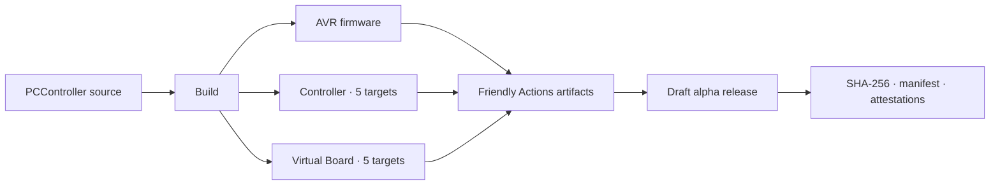

<div align="center">
  <h1>⚡ PCController</h1>
  <p><strong>One controller. Three first-class deliverables. Five native host targets.</strong></p>
  <p>
    <a href="https://github.com/atomicdeploy/PCController/actions/workflows/build.yml"></a>
    <a href="https://github.com/atomicdeploy/PCController/actions/workflows/repository-health.yml"></a>
    <a href="https://github.com/atomicdeploy/PCController/actions/workflows/update-dependencies.yml"></a>
    <a href="https://github.com/atomicdeploy/PCController/actions/workflows/release.yml"></a>
    <a href="LICENSE"></a>
  </p>
  <p>ATmega328P firmware, a production-oriented Go control surface, and a native<br>virtual board for the ControllerBoardMini ecosystem.</p>
  <p>
    <a href="https://github.com/atomicdeploy/PCController/releases">Download a release</a> ·
    <a href="https://github.com/atomicdeploy/PCController/actions/workflows/build.yml">Watch the flagship build</a> ·
    <a href="docs/README.md">Read the docs</a>
  </p>
</div>

> [!IMPORTANT]
> The current release line is **alpha**. Host executables are not platform
> code-signed, and a successful GitHub build or provenance attestation is not a
> physical-device acceptance test. AVR programming requires an explicitly
> approved, self-hosted runner with the target attached; ordinary CI never
> opens a serial port or programmer.

## Choose your download

| I want to… | Download | Runs on / targets |
|---|---|---|
| Program the ControllerBoardMini | `PCController-Firmware-<version>-AVR-ATmega328P.tar.gz`, `PCController-<version>-ATmega328P-Application.hex`, or `PCController-<version>-ATmega328P-Full-Flash-Urboot.hex` | ATmega328P, MiniCore 3.1.2 |
| Control a real board | `PCController-Controller-<version>-<platform>.tar.gz` | Linux x64/ARM64, Windows x64, macOS Intel/Apple Silicon |
| Explore and test without hardware | `PCController-VirtualBoard-<version>-<platform>.tar.gz` | Linux x64/ARM64, Windows x64, macOS Intel/Apple Silicon |
| Verify a release | `SHA256SUMS.txt`, release manifest, and GitHub attestations | Any SHA-256-capable system |

Each archive expands into a versioned, product-named root rather than loose
generic files. Actions artifacts use the friendly names
`PCController-Firmware-ATmega328P`, `PCController-Controller-<platform>`, and
`PCController-VirtualBoard-<platform>`; the flagship also publishes the same
flat AVR payload under the exact inspiration alias `firmware`. Release assets
add the version. In the
patterns above, `<version>` includes the leading `v`.

## What ships

| Layer | Highlights | Build evidence |
|---|---|---|
| AVR firmware | 15-page TM1637 menu, COBS/CRC UART, INA219 and DS18B20 telemetry, 16 PWM outputs, guarded dual-side motion, learned 433 MHz actions, EEPROM settings | Real MiniCore compile, strict Intel HEX validation, memory report, SHA-256 manifest |
| Controller | Charm TUI, monitor and shell, JSON-RPC/REST/WebSocket surfaces, Go API, C ABI library, programmer launcher, configuration, histories, macros and automation | Go test/vet, native build, executable identity, C ABI smoke test |
| Virtual Board | Hardware-free protocol and behavior simulator for development and CI | Native CMake build and CTest on all five host targets |

### Current AVR footprint

| Region | Used | Free | Utilization |
|---|---:|---:|---:|
| Application flash | 32,240 / 32,256 bytes | 16 bytes | 99.95% |
| Static SRAM | 1,441 / 2,048 bytes | 607 bytes | 70.36% |
| Estimated peak SRAM | Not revalidated after integration | — | — |

These are the latest verified source-only figures for build `F6D76FE4` under
the 32,256-byte Urboot-Custom application ceiling, not a claim about the
still-unbuilt post-integration tree. The memory tables and manifests attached
to the latest successful
[flagship build](https://github.com/atomicdeploy/PCController/actions/workflows/build.yml)
are authoritative for that artifact. Complete cap24 host-menu overlays remain
in the Controller and Virtual Board; the space-constrained AVR keeps its exact
cap19 front-panel push fallback.

## Quick start

Build everything without touching hardware:

```console
build.cmd --all --clean --no-upx
```

```bash
./build.sh --all --clean --no-upx
```

Or download the matching Controller and Virtual Board packages from the latest
[release](https://github.com/atomicdeploy/PCController/releases). For one
archive, download its matching `.sha256` sidecar; Linux uses `sha256sum`, macOS
uses `shasum -a 256`, and Windows PowerShell uses `Get-FileHash`. Linux and
macOS extract with `tar -xzf`; current Windows includes `tar.exe -xzf`. The
[CI/CD and releases guide](docs/CI-CD-and-Releases.md) gives copy-ready commands
for all three platforms. Then continue with
[Getting Started and Operations](docs/Getting-Started-and-Operations.md).



## Firmware and host capabilities

The hash/timestamp-identified firmware provides:

- a mode-driven, 15-page TM1637 menu with persistent visibility, ordering,
  categories, cached flicker-free updates, and Status as stable page 0;
- native COBS/CRC UART commands and telemetry at 115200 8N1;
- INA219 voltage/current/power and two DS18B20 temperatures;
- 16 PWM outputs, safe dual-side relay motion, and R5-R8 user control;
- enclosure-light automation, power indication, PWM RGB status, and an
  11-pixel WS2811/WS2812 layer ready for future effects;
- 433 MHz receive/transmit, learning of 20 remote buttons, and persistent
  action mappings;
- a Timer1 hardware buzzer, advanced button gestures, host-owned 16x2 I2C LCD,
  and CRC-checked EEPROM settings and reset telemetry.

The latest verified source-only cap23 checkpoint, `F6D76FE4`, uses 32,240 of
the 32,256 application bytes available with Urboot-Custom and 1,441 of 2,048
static SRAM bytes, leaving 16 application bytes. The merge-integrated source
must be rebuilt before those figures can be claimed for it. Complete cap24
host-menu overlays remain available in the host and virtual board; the
physical AVR uses its cap19 exact front-panel push fallback because a complete
cap24 implementation does not fit honestly in the remaining space. The newest
firmware has not yet been uploaded, the newest host has not yet been packaged
or launched, and Urboot-Custom has not been installed. Older board and host
results are historical checkpoints, not claims about the next frozen image.

The companion tool under [Tools/Controller](Tools/Controller/README.md) provides
a ten-page Charm TUI, an embedded responsive RTL/LTR web control center,
continuous monitor, CLI/shell, scripts, JSON-RPC/REST,
standard WebSocket and bounded Socket.IO service, Go API, C-compatible dynamic
library, programmer launcher, and WebSocket firmware relay. It also supports
PC-side JSON/YAML/TOML configuration with live reload, histories/graphs,
macros, and automations. Global-hotkey/Windows-notification, mDNS/SSDP,
webhook, and host-to-host bridge surfaces are documented with their current
commissioning limits in the checklist. Stable USB identity,
event-driven reconnect, an ambiguity picker, and primary-instance IPC keep one
serial owner; DTR reset is an independent, default-disabled option.

`controller.exe web` is a complete headless primary mode, not a terminal UI
wrapper: it owns discovery, serial, automations, hotkeys, integrations, the
command dispatcher, and the browser event stream without constructing or
reading from the TUI. Browser terminal commands and live status/events share
the same authenticated host runtime, while a global `app.page` action fans out
to both terminal and browser clients when both surfaces are in use.
Exact wire formats and opcodes are in the
[protocol and network API reference](Tools/Controller/docs/Protocol-and-Network-API.md).
Start with [Getting Started and Operations](docs/Getting-Started-and-Operations.md) for the physical
menu, host commands, configuration, programming, RF, macros, IPC, safety, and
troubleshooting. New-machine setup and the recoverable flash sequence are in
[Toolchain Bootstrap and Safe Programming](docs/Toolchain-and-Safe-Programming.md).
The [documentation index](docs/README.md) gives a complete,
starter-friendly reading order and keeps MCU EEPROM ownership separate from
host-side configuration.
The focused [Host Configuration and Integrations](docs/Host-Configuration-and-Integrations.md)
guide covers the TUI and web app, USB/DTR behavior, hotkeys, notifications,
local-device capabilities, the loopback data hub, discovery, webhooks, remote bridges, and
commissioning boundaries.
The [Hardware Initialization and Tuning](docs/Hardware-Initialization-and-Tuning.md)
reference lists the exact INA219, PWM, DS18B20, display, RF, I2C, relay, LED,
timer, and UART settings, their rationale, and safe alternatives.

## Hardware map

| Function | ATmega328P port | Arduino pin |
|---|---:|---:|
| Native application UART / Urboot upload | PD0/PD1 | D0/D1 |
| 433 MHz receive | PD2/INT0 | D2 |
| 433 MHz transmit | PD3/INT1 | D3 |
| Shift input load | PD4 | D4 |
| Shift master reset | PD5 | D5 |
| WS2811/WS2812 data | PD6 | D6 |
| Shift clock enable | PD7 | D7 |
| Shift output enable | PB0 | D8 |
| Buzzer/Timer1 OC1A | PB1 | D9 |
| Two-sensor OneWire bus | PB2/SS | D10/CS |
| TM1637 data | PB3/MOSI | D11 |
| Spare | PB4/MISO | D12 |
| TM1637 clock | PB5/SCK | D13 |
| Shift serial input | PC0 | A0 |
| Shift output latch | PC1 | A1 |
| Shared shift clock | PC2 | A2 |
| Shift serial output | PC3 | A3 |
| I2C SDA/SCL | PC4/PC5 | A4/A5 |

The DS18B20 data line needs an external pull-up, normally 4.7 kΩ to the
sensor logic supply. The buzzer owns Timer1; do not use Servo or
`analogWrite()` on D9/D10 at the same time.

### I2C addresses

| Device | Address | Notes |
|---|---:|---|
| INA219 | `0x40` | voltage/current monitor |
| 16-channel PWM expander | `0x41` | A0 strapped so it cannot collide with INA219 |
| Optional PCF8574 LCD backpack | `0x27` or `0x3F` | both are probed |

There is no expected I2C conflict with this map. TM1637 and the two
temperature sensors are not I2C devices. The LCD driver assumes the common
PCF8574-to-HD44780 backpack mapping; a differently wired backpack needs a
driver adjustment. Run `i2c scan` from the host to see every live address.

### Shift-register assignments

The first four active-low 74HC165 inputs are the controls:

| Input bit / key | Normal menu action |
|---:|---|
| 0 / Key 1 | Previous |
| 1 / Key 2 | Next |
| 2 / Key 3 | Decrease |
| 3 / Key 4 | Increase / Enter |
| 4 | Reserved system sense 1 |
| 5 | Reserved system sense 2 |
| 6 | Bluetooth audio-module LED sense |
| 7 | Door reed switch |

Bluetooth defaults active-low and door-open defaults active-high. If the
board's buffers invert either signal, change
`PCCONTROLLER_BT_LED_ON_RAW_HIGH` or
`PCCONTROLLER_DOOR_OPEN_RAW_HIGH` in `ProjectConfig.h`.

The active-low 74HC595 relay outputs are:

| Relay | Assignment |
|---:|---|
| R1 | Side A direction |
| R2 | Side A enable |
| R3 | Side B direction |
| R4 | Side B enable |
| R5-R8 | General-purpose user outputs 1-4 |

Direction changes are sequenced nonblockingly: disable, an EEPROM-selected
1 ms factory break or conservative 100 ms break, change direction, 50 ms
settle, then enable. Use a side-motion command instead of
direct R1-R4 writes whenever possible. The PC host performs a fresh
fail-closed door check before R1-R4/side/macro starts, but that serial
query-plus-command is not atomic; local MOVE and learned RF Side actions also
apply firmware reed interlocks.

### PWM channel assignments

Logical `0` is off and `4095` is fully active. The current MOSFET stages are
active-high and the expander runs at 1 kHz.

| Channels | Assignment |
|---:|---|
| 0-7 | Eight persistent user lighting outputs |
| 8-10 | Three additional user outputs |
| 11 | Enclosure illumination |
| 12 | Power/On indicator |
| 13-15 | Status RGB: red, green, blue |

The automatic identification demo cycles only channels 0-10. It never takes
over enclosure, power, or status channels. Make connected loads safe before
using Auto mode.

Channel 11 follows the saved Off/Auto/On enclosure mode and fades between the
saved Off and On brightness levels. Auto follows the door reed. Channels
13-15 show boot, ready, learning, warning, and fault states. The separate D6
addressable strip starts black and is retained for later effects.

## Sensors

The voltage display uses INA219 supply voltage (`bus + shunt`) rather than the
bus register alone. On a nominal 12 V supply it should be close to a meter
reading between INA219 VIN+ and ground. If it remains near 10 V, check VIN+,
shunt orientation, the shared ground, and the voltage at the module; the
firmware does not add an arbitrary correction.

DS18B20 ROM addresses are sorted for repeatable startup ordering, and the host
reports each 64-bit ROM. `tLED` is the illumination sensor and `tBT` is the
Bluetooth-module sensor. The canonical default maps the lower sorted ROM to
tLED and the higher ROM to tBT; settings flag bit 2 reverses that assignment.
Turn the enclosure light on to confirm the harness: tLED should rise from
roughly 26 °C toward 28 °C while tBT stays cool.

## Menu and controls

The four controls are Key 1 Previous, Key 2 Next, Key 3 Decrease, and Key 4
Increase/Enter. A press responds immediately; a hold begins after 600 ms,
repeats every 150 ms, and accelerates to 60 ms after 1.8 seconds where
repetition is meaningful. Double-clicking Key 1 returns to the configured
default page. Every gesture is also emitted as a UART event.

The root pages are:

| # | Display | Purpose | Key 3 / Key 4 at the root |
|---:|---|---|---|
| 0 | `STAT` | door `OPEN` or `CLSd` home page | read-only |
| 1 | `VOLT` | supply voltage | read-only |
| 2 | `CURR` | current in mA | read-only |
| 3 | `tLED` | illumination temperature (`tLED`) | read-only |
| 4 | `t-bt` | Bluetooth temperature (`tBT`) | read-only |
| 5 | `LItE` | enclosure Off/Auto/On and brightness | Key 4 enters editor |
| 6 | `bt` | Bluetooth LED Off/On/Blink state | read-only |
| 7 | `Snd` | sound, display/status, and reading precision | Key 4 enters six-item settings submenu |
| 8 | `PWM` | all-channel Off/Manual/Auto test | Key 4 enters editor |
| 9 | `rELY` | relay identification/test | Key 3 All Off; Key 4 enters editor |
| 10 | `KEY` | key identification | any pressed key shows `1`-`4` |
| 11 | `uPWM` | saved 8-bit values for PWM 0-7 | Key 4 enters editor |
| 12 | `r5-8` | user-relay toggle/momentary control | Key 4 enters control |
| 13 | `MOVE` | two-side Up/Down control | Key 4 enters if the configured door policy permits it |
| 14 | `LErn` | learned 433 MHz buttons | Key 4 starts one-code learning |

The `Snd` submenu steps through `Snd`, `diSP`, `StBr`, `CoLr`, `V-dP`, and
`A-dP` before Save/Discard. It controls sound, TM1637 brightness, status
brightness and Ready color, and voltage/current decimal precision.

Detailed editor/control behavior is in
[Front Panel and Menus](docs/Front-Panel-and-Menus.md). Important safety behavior:

- MOVE maps keys 1/2 to Side A forward/reverse and keys 3/4 to Side B
  forward/reverse; releasing a key stops that side.
- Hold both direction keys of either side for 600 ms to stop everything and
  leave MOVE.
- Closing the enclosure door immediately stops both sides and exits MOVE.
- R5-R8 can be selected independently and operated as Toggle or momentary
  Push.
- EEPROM-backed editors end at a save prompt. Key 2 or 4 saves; Key 1 or 3
  discards. `SAVE` or `diSC` then flashes for 900 ms with distinct audio cues.

TM1637 output is cached at the segment level. The 20 ms display service is
only a decision interval; unchanged segments are not retransmitted, which
removes the former visible refresh flicker. The optional LCD also caches both
16-character rows.

## Learned 433 MHz remotes

The firmware stores up to 20 learned remote-button records. A newly learned
code remains unassigned until the user chooses its mapping. From the host,
records can be
listed, learned, removed individually, cleared, or mapped to:

- Key 1-4 or Previous/Next/Decrease/Increase;
- relay R1-R8 with press, toggle, or momentary behavior;
- Side A/B Up, Down, or Stop;
- PWM user channel 0-10 with press, toggle, or momentary behavior;
- no action.

The firmware deliberately uses **learn** terminology to distinguish the
433 MHz function from Bluetooth. RF receive is D2/INT0 and transmit is
D3/INT1.

## Persistent settings

The canonical cap23 layout stores an unversioned packed 29-byte settings value
plus one CRC-8 byte at EEPROM address 32 and uses `EEPROM.update()`.
Deferred writes wait 1.5 seconds to reduce wear. It stores:

- sound/mute, door/relay audio, tLED/tBT assignment, motion-door policy, and
  the 1/100 ms direction-break choice;
- enclosure mode and its two brightness levels;
- TM1637/status-light brightness and persistent Ready-state color;
- voltage/current decimal precision from zero through two places;
- PWM boot mode and user PWM 0-7 levels;
- telemetry stream period;
- default/save-last menu page plus cap23 menu visibility and ordering.

Sound defaults **on**, LCD ownership is host-side, save-last-page defaults off,
motion is allowed regardless of door state, the short motion break defaults to
1 ms, and PWM Auto is the factory boot mode. Existing valid EEPROM overrides
defaults because the build profile retains EEPROM during uploads. There is no
settings magic/version or firmware-side migration chain: an invalid settings
CRC loads canonical defaults and is rewritten. Learned RF records use a
separate 20-slot area whose header describes record width and capacity rather
than a project version; every populated record remains CRC checked.

## Native UART

UART is the primary application interface and bootloader upload path. Native
application frames use COBS with a `0x00` delimiter, CRC-8/ATM, one-byte
opcodes, sequence IDs, and payloads up to 48 bytes. The emitted envelope
revision is advisory: receivers validate framing and known opcode semantics,
ignore supported trailing extensions, and return `Unsupported` for unknown
operations. Commands cover settings,
menu navigation/page selection, relays, all PWM channels, status RGB, the
addressable strip, buzzer, TM1637/LCD text, RF, macros, temperature identities,
application/bootloader reset, and I2C scan.

The board emits unsolicited boot `HELLO`, periodic or requested `STATUS`, and
asynchronous `EVENT` messages. Unsolicited frames use sequence 0; direct
responses echo the host's nonzero request sequence.

Automatic detection accepts COM ID, friendly name, VID/PID, USB serial, or
Windows PnP instance selectors, but a candidate is accepted only after it
returns the `PCController` identity. A successful HELLO remembers the stable
identity in host JSON, and an interactive chooser resolves ambiguity. The
first long-running host is the serial owner; later host processes route through
its loopback IPC rather than opening COM18 again.

Common commands after building the host:

```console
Tools\Controller\bin\controller.exe ports
Tools\Controller\bin\controller.exe exec --port COM18 hello
Tools\Controller\bin\controller.exe exec --port COM18 status
Tools\Controller\bin\controller.exe exec --port COM18 settings
Tools\Controller\bin\controller.exe monitor --port COM18
Tools\Controller\bin\controller.exe tui --port COM18
Tools\Controller\bin\controller.exe tui --device "USB-SERIAL CH340"
```

The TUI and monitor continuously update voltage, current, power,
temperatures, keys, door, Bluetooth, relays, menu/mode, and PWM state. The
same functions are available to batch scripts, JSON-RPC clients, an
importable Go package, and the generated `pccontroller.dll` JSON ABI. See the
[host guide](Tools/Controller/README.md) for shell, IPC, library, programming,
and WebSocket examples.

## Build and programming

The target is MiniCore 3.1.2 with its UART0 Urboot loader:

```text
MiniCore:avr:328:bootloader=uart0,eeprom=keep,baudrate=115200,variant=modelP,BOD=2v7,LTO=Os_flto,clock=16MHz_external
```

`build.cmd` and `build.sh` are thin launchers for one project-owned Node build
and packaging implementation. It keeps the colored VT-100/emoji stages,
tests and vet, Win32 resources, deterministic identity, SHA-256 manifests,
C ABI smoke test, and UPX pack/test aligned without invoking PowerShell.
The default build is hardware-free.

```bat
build.cmd --dry-run
build.cmd --host-only
build.cmd --firmware-only
build.cmd --upload --port COM18
build.cmd --usbasp-flash
```

```bash
./build.sh
./build.sh --upload --port COM18
```

Host packaging publishes only to `Tools/Controller/bin`; firmware compile
publishes only to `.build/firmware`. Firmware compile, resolved toolchain
synchronization (`--toolchain-sync`), Urclock programming, and guarded USBasp recovery
all route through the Controller interface. Direct Arduino upload is disabled,
and USBasp requires explicit troubleshooting authorization. The duplicated
PowerShell build scripts were removed; CMD and Bash now share the same Node
plan instead of carrying divergent policy.
See the [build-tool guide](Tools/Build/README.md).

GitHub Actions runs the same safety gates for AVR firmware and complete native
host packages on Linux x64/ARM64, Windows x64, and macOS Intel/ARM64. The
virtual board is compiled and tested on the same five targets. Every downloadable
package is a versioned archive with deterministic build identities, a SHA-256
sidecar, and a job summary; tag and manual release builds also receive GitHub
build-provenance attestations. See
[CI/CD and releases](docs/CI-CD-and-Releases.md).

The ASA0002E-style Node firmware studio adds content-watched builds, serialized
and debounced programming, byte-identical edit suppression, strict Intel HEX
checksum/address/size validation, SHA-256 manifests, atomic flash backups, and
safe dry-runs. It is a dependency-free single script exposed by aligned CMD
and Bash wrappers:

```console
firmware.cmd build
firmware.cmd check
firmware.cmd watch
firmware.cmd watch --upload --method urclock --port COM18
firmware.cmd upload --method usbasp --programmer usbasp --usbasp-troubleshooting --dry-run
```

```bash
./firmware.sh build
./firmware.sh watch
./firmware.sh upload --port /dev/ttyUSB0
```

`build` and build-only `watch` never open hardware. Every UART operation
requires an explicit `--port` (or `PCCONTROLLER_PORT`), while ISP requires an
explicit `--method usbasp --usbasp-troubleshooting`. All programming methods
perform a hardware-free build and strict HEX/SHA-256 validation before
Controller starts Urclock or USBasp. The USBasp path requires the complete
merged application + Urboot image and retains the Controller's EESAVE
preflight. See
[Firmware studio](Tools/Firmware/README.md).

The default build never programs hardware. `--upload` uses the
UART bootloader and `urclock` path on COM18. USBasp is needed only to provision
Urboot/fuses or recover an unbootable controller. Never run serial upload and
ISP programming together; disconnect USBasp before testing bootloader reset
and automatic UART reconnect.

The host can also capture flash, EEPROM, programmer output, and build metadata
into a timestamped, SHA-256-manifested backup:

```console
Tools\Controller\bin\controller.exe boot backup .\backups --device "USB-SERIAL CH340"
```

The backup workflow is unit-tested but has not yet been exercised against this
live board/AVRDUDE.

## Libraries and footprint

Only these Arduino libraries are linked by the current firmware:

| Library | Installed version | Current use |
|---|---:|---|
| EEPROM | MiniCore 2.0 | CRC-checked MCU settings and learned RF records |
| rc-switch | 2.6.4 | 433 MHz receive and transmit |

I2C is provided by the project's fixed-hardware `CompactI2c` master, not by
MiniCore Wire.

The installed, well-supported alternatives remain available:
TM1637TinyDisplay 1.12.2, OneWire 2.3.8, DallasTemperature 4.0.6, Adafruit
INA219 1.2.3, and Adafruit PWM Servo Driver 3.0.3. They are intentionally not
linked here: small fixed-hardware TM1637, DS18B20, INA219, PWM-expander, and
LCD drivers, including the custom D6 WS2811/WS2812 sender, save substantial
ATmega328P flash. Adafruit NeoPixel remains installed but is not linked.

The current linked-size audit and prioritized removal options are in
[Memory and Feature Tradeoffs](docs/Memory-and-Feature-Tradeoffs.md). The full
LocalLib comparison is in [Local Library Merge History](docs/Local-Library-Merge-History.md).

## Hardware smoke test

1. Make all PWM loads and mechanisms safe.
2. Reset the board and confirm the three-note melody. Sound is on by default;
   valid retained EEPROM may override it.
3. Press input bits 0, 1, 2, and 3. They should navigate or edit and produce
   one clean short beep. On the KEY page they must show 1, 2, 3, and 4.
4. Query `hello`, `status`, `i2c scan`, and `settings` on COM18.
5. Expect `0x40` and `0x41`, plus `0x27` or `0x3F` if the LCD is present.
6. Compare reported supply voltage with a meter at INA219 VIN+.
7. Open/close the door and verify input bit 7 plus channel-11 fading.
8. Turn illumination on and verify tLED warms while tBT stays cool; swap the
   temperature flag if the labels are reversed.
9. Exercise the Bluetooth module and verify input bit 6 reports Off/On/Blink.
10. With the mechanism safe and door open, test MOVE one direction at a time,
    release-to-stop, the two-key exit gesture, and door-close emergency exit.
11. Learn a remote button, list it from the PC, map it to a harmless menu
    action, and then verify explicit 433 MHz transmit.

## Why the buzzer glitch stopped

The inherited implementation used Arduino `tone()`, whose AVR implementation
generates the waveform from a timer compare interrupt. That audio-rate ISR
competed with the 433 MHz edge interrupt and was delayed whenever timing
critical sensor code briefly masked interrupts, so edges could arrive late
and the audible period became uneven.

The current player uses D9's Timer1 OC1A hardware compare output directly.
Once configured, the AVR toggles the buzzer pin without an audio-rate ISR,
even while application interrupts are briefly busy. Tone changes remain
nonblocking in the main loop, and stop/start register changes are atomic.
That timer-contention removal is the reason the startup tune and key beeps
are now clean.

## License

Original PCController code and documentation are available under your choice
of `MIT OR BSD-2-Clause`; see [LICENSE](LICENSE). Third-party components keep
their upstream terms. In particular, the adapted AVR WS281x timing loop is
`LGPL-3.0-or-later`, while the OneWire/Dallas-derived ROM-search and CRC code
is `MIT`. See [THIRD_PARTY_NOTICES.md](THIRD_PARTY_NOTICES.md) for the complete
dependency and provenance audit.
