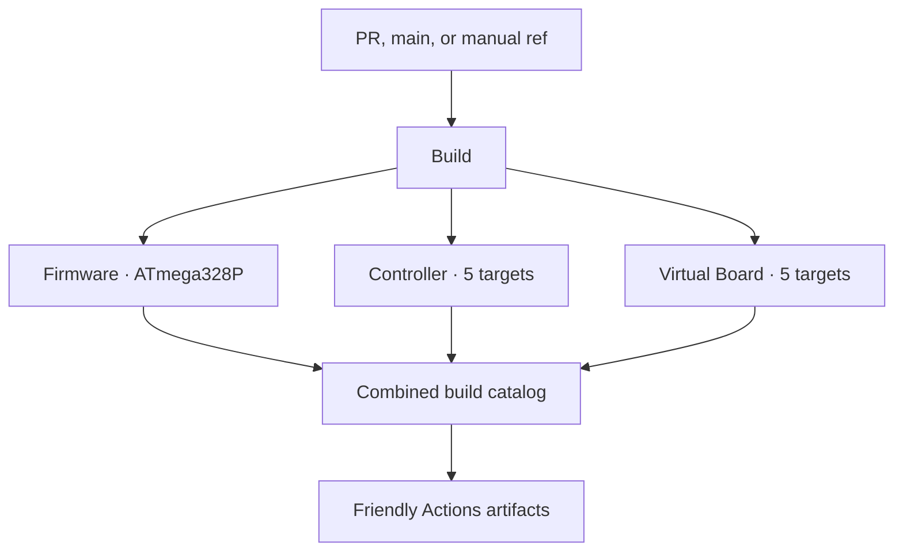

# CI/CD and Releases

PCController's GitHub automation builds the real AVR firmware, native
Controller, and native Virtual Board from one exact source commit. The
flagship run is designed to be useful before a log is opened: its summary is a
download catalog, compatibility matrix, memory report, validation record, and
release-readiness view.

> [!IMPORTANT]
> GitHub-hosted CI is hardware-free. A green firmware job proves compilation,
> HEX integrity, packaging, and provenance; it does **not** prove that a board
> was programmed or passed a physical smoke test. Host binaries are currently
> unsigned alpha artifacts. Attestation proves build origin, not platform code
> signing.

## Workflow map

| Workflow | Role | Triggers |
|---|---|---|
| `Build` (`build.yml`) | Flagship orchestrator and combined download catalog | pull request, `main`, manual dispatch |
| `⚡ Firmware · AVR` (`firmware.yml`) | Reusable MiniCore compile, HEX validation, footprint and firmware package | called by Build and Release |
| `🖥️ Controller · Cross-platform` (`host.yml`) | Reusable Go test/vet, identity, C ABI smoke test and five-target packaging | called by Build and Release |
| `🧪 Virtual Board · Cross-platform` (`virtual-board.yml`) | Reusable native CMake/CTest and five-target packaging | called by Build and Release |
| `🛡️ Quality · Repository Health` (`repository-health.yml`) | Source, license, docs, build-tool, workflow and whitespace audits | pull request, `main`, manual dispatch |
| `Dependency Resolution and Validation` (`update-dependencies.yml`) | Latest-compatible resolution, full pre-PR validation, evidence, and blocked-update diagnostics | daily schedule, manual dispatch |
| `✨ Release · Attested Packages` (`release.yml`) | Rebuild, attest, and create or update a deterministic release | `v*` tag, manual dispatch |
| `🔌 Deploy · Protected AVR Hardware` (`deploy-avr.yml`) | Explicitly gated physical programming path | manual dispatch on approved self-hosted runner only |

The three build workflows remain independently callable and reusable, while
the flagship workflow presents them as one product:



## Builds and Actions artifacts

| Deliverable | Actions artifact | Validation |
|---|---|---|
| AVR firmware | `<product slug>-Firmware-ATmega328P` | Package-metadata identity, canonical MiniCore lock and all six firmware libraries, real compile, strict Intel HEX validation, 32,256-byte ceiling, flash/static/estimated-peak SRAM report, dependency inventory |
| AVR inspiration-compatible alias | `firmware` | Identical flat AVR payload from flagship `Build`, preserving the ASA0002E `Build` / `build` / `firmware` contract |
| Controller | `PCController-Controller-Linux-x64`, `-Linux-ARM64`, `-Windows-x64`, `-macOS-Intel`, `-macOS-Apple-Silicon` | Go tests and vet, executable identity, native package, C ABI library and smoke test |
| Virtual Board | `PCController-VirtualBoard-Linux-x64`, `-Linux-ARM64`, `-Windows-x64`, `-macOS-Intel`, `-macOS-Apple-Silicon` | Native CMake build and CTest |

Every archive carries a matching `.sha256` sidecar and expands into a
versioned, product-specific root. For example:

```text
PCController-Controller-v0.1.0-alpha.1-Linux-x64/
PCController-VirtualBoard-v0.1.0-alpha.1-Windows-x64/
PCController-Firmware-v0.1.0-alpha.1-AVR-ATmega328P/
```

That layout keeps multiple versions and targets safe to extract into the same
download directory. The workflow fails if an expected binary, library,
manifest, license, or checksum is missing.

Each archive's `.sha256` sidecar is the simplest way to verify one selected
download. Use the platform-native command for the package you downloaded:

**Linux**

```bash
archive=PCController-Controller-v0.1.0-alpha.1-Linux-x64.tar.gz
sha256sum --check "${archive}.sha256"
tar -xzf "$archive"
```

**macOS**

```bash
archive=PCController-Controller-v0.1.0-alpha.1-macOS-Apple-Silicon.tar.gz
shasum -a 256 -c "${archive}.sha256"
tar -xzf "$archive"
```

**Windows PowerShell**

```powershell
$archive = "PCController-Controller-v0.1.0-alpha.1-Windows-x64.tar.gz"
$expected = ((Get-Content -LiteralPath "$archive.sha256" -Raw) -split '\s+', 2)[0]
$actual = (Get-FileHash -LiteralPath $archive -Algorithm SHA256).Hash
if ($actual.ToLowerInvariant() -ne $expected.ToLowerInvariant()) {
  throw "SHA-256 mismatch: $archive"
}
tar.exe -xzf $archive
```

Every command extracts one product-named version root. The Windows release is
currently a `.tar.gz`, so `tar.exe` is the native matching extractor; it is not
necessary to install a Unix shell.

Artifact retention is deliberate:

- pull-request artifacts are retained for **14 days**;
- `main`, tags, and manual-run artifacts are retained for **90 days**;
- GitHub release assets remain available with the release until a maintainer
  removes them.

Each job writes a polished step summary with the source commit, target and
toolchain, validation results, artifact link, file sizes and SHA-256 hashes.
The AVR summary additionally shows visual and text flash/SRAM meters, exact
free space, linked libraries, build configuration, and the stack-headroom
estimate. The combined flagship summary is the authoritative platform chooser.

## Release integrity

A release never relabels packages from an older run. Both entry points build
the exact event source SHA:

- a `v*` tag build uses the commit named by that tag;
- a manual run must be launched from the desired branch, tag, or commit in the
  GitHub **Run workflow** selector and uses that run's immutable `github.sha`.

The same SHA is passed into every reusable checkout, recorded in every
manifest, and used as the release's target commit. A mutable branch name is
never substituted after the build, preventing tag/package/provenance drift.

After all eleven platform/firmware packages pass, Release:

1. downloads only the artifacts produced by that exact invocation;
2. promotes the firmware application and merged Urboot images as direct assets:
   `PCController-<version>-ATmega328P-Application.hex` and
   `PCController-<version>-ATmega328P-Full-Flash-Urboot.hex`;
3. generates a deterministic `SHA256SUMS.txt`, release manifest, and release
   notes containing the source SHA, platform chooser, compatibility details,
   verification commands, and honest hardware limitations;
4. creates GitHub build-provenance attestations for release subjects;
5. creates or updates the matching release without appending duplicate notes.

Manual releases default to draft and prerelease. A hyphenated SemVer tag is
also treated as a prerelease. `v0.1.0-alpha.1` is intentionally an alpha: it
can demonstrate fresh compilation, native tests, package integrity, and build
provenance while physical-device acceptance stays a separate, recorded
operation.

After the checksum succeeds, verify GitHub build provenance on Linux or macOS:

```bash
gh attestation verify PCController-Controller-v0.1.0-alpha.1-Linux-x64.tar.gz \
  --repo atomicdeploy/PCController
```

Or in PowerShell:

```powershell
gh attestation verify .\PCController-Controller-v0.1.0-alpha.1-Windows-x64.tar.gz `
  --repo atomicdeploy/PCController
```

`SHA256SUMS.txt` covers all eleven archives and both direct firmware images.
Running a whole-file `--check` is appropriate only when every listed payload
is present; missing files correctly make that command fail. For a single
archive, use its sidecar as shown above. For a direct HEX, select its exact line
from `SHA256SUMS.txt` or verify its GitHub attestation.

## Dependency automation

One scheduled workflow runs the project-owned latest-compatible resolver in
`Tools/Dependencies/update.mjs`. Its firmware policy and exact source hashes
come only from `Tools/Controller/toolchain-profile.json` and
`toolchain-lock.json`; host tools have the equivalent policy/lock pair in
`Tools/Dependencies`. The updater covers MiniCore, the dependency CLI, Urboot,
Go, Node.js, UPX, go-winres, both npm domains, Go modules, and all six requested
firmware libraries. It inherits proxy variables, retries once without them only
after a configured-route failure, and never persists credentials.

A scheduled apply performs the complete firmware, Urboot-Custom, host, web,
VirtualBoard, package, and memory-ceiling gate before opening or refreshing a
reviewable pull request. A failed candidate produces an evidence artifact and
one actionable blocked-update issue instead of a broken PR. Manual check-only
dispatch reports drift without changing locks. Firmware and protected-deploy
workflows use the small read-only `Tools/Dependencies/export-lock.mjs` adapter;
that adapter exports CI values from the same canonical lock and is not a second
resolver or updater.

Dependabot independently checks GitHub Actions, Go modules, and npm lock
domains.
Minor and patch updates may be grouped to reduce noise; major updates remain
isolated for review. The complete flagship build exposes any resulting flash
or SRAM movement before an Arduino dependency proposal can be merged.

## Gated hardware deployment

The AVR deploy workflow is intentionally separate from build and release. It
runs only through manual dispatch on an approved, labeled self-hosted runner
with a protected GitHub Environment. It requires explicit target/method inputs
and confirmation, verifies the selected firmware SHA-256 before invoking the
project's guarded programmer path, and retains the deployment log.

The device job remains inert until repository setup explicitly sets
`ENABLE_AVR_DEPLOY=true`, configures the protected `avr-hardware` environment,
and registers a trusted runner with the `pccontroller-avr` label. The workflow
file alone does not satisfy any of those hardware gates.

The presence of this workflow is not evidence of a successful upload. Record
the board identity, firmware hash, port/programmer, backup, read-back result,
and smoke-test evidence for each physical acceptance. Never connect serial
upload and ISP programming at the same time.

## Local parity checks

On Windows, the highest-value hardware-free pre-push checks are:

```bat
build.cmd --all --clean --no-upx --version v0.1.0-alpha.1
cmake -S Tools\VirtualBoard -B .build\virtual-board -DBUILD_TESTING=ON
cmake --build .build\virtual-board --config Release --parallel
ctest --test-dir .build\virtual-board -C Release --output-on-failure
```

On Linux or macOS, use `./build.sh` with the same build arguments. None of the
commands above programs hardware. See the
[build-tool guide](../Tools/Build/README.md) for dependency setup and the
[firmware studio guide](../Tools/Firmware/README.md) for guarded upload paths.
