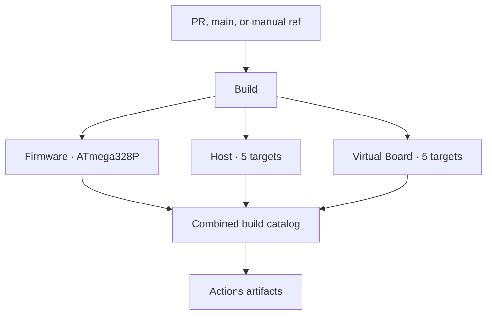

# CI/CD and Releases

PCController's GitHub automation builds AVR firmware, the native Host, and the
native Virtual Board from one source commit. Build provides a download catalog,
compatibility matrix, memory report, and validation record.

> [!IMPORTANT]
> GitHub-hosted CI is hardware-free. A green firmware job proves compilation,
> HEX integrity, packaging, and provenance; it does **not** prove that a board
> was programmed or passed a physical smoke test. Host binaries are currently
> unsigned alpha artifacts. Attestation proves build origin, not platform code
> signing.

## Workflow map

| Workflow | Role | Triggers |
|---|---|---|
| `Build` (`build.yml`) | Build orchestrator and combined download catalog | pull request, `main`, manual dispatch |
| `⚡ Firmware · AVR` (`firmware.yml`) | Reusable MiniCore compile, HEX validation, footprint and firmware package | called by Build and Release |
| `🖥️ Host · Cross-platform` (`host.yml`) | Reusable Go test/vet, identity, C ABI smoke test and five-target packaging | called by Build and Release |
| `🧪 Virtual Board · Cross-platform` (`virtual-board.yml`) | Reusable native CMake/CTest and five-target packaging | called by Build and Release |
| `🛡️ Quality · Repository Health` (`repository-health.yml`) | Source, license, docs, build-tool, workflow and whitespace audits | pull request, `main`, manual dispatch |
| `🛡️ Security · CodeQL` (`codeql.yml`) | Six-category security-extended scan across every supported repository language and platform-specific source branch | pull request, merge queue, `main`, weekly schedule, manual dispatch |
| `🔭 Dependencies · AVR Supply Chain` (`dependencies.yml`) | Daily pinned-toolchain health report and verified update proposal | daily schedule, manual dispatch |
| `✨ Release · Attested Packages` (`release.yml`) | Rebuild, attest, and create or update a deterministic release | `v*` tag, manual dispatch |
| `🔌 Deploy · Protected AVR Hardware` (`deploy-avr.yml`) | Explicitly gated physical programming path | manual dispatch on approved self-hosted runner only |

The three build workflows remain independently callable and reusable, while
Build presents them as one product:



## Builds and Actions artifacts

| Deliverable | Actions artifact | Validation |
|---|---|---|
| AVR firmware | `PCController-Firmware-ATmega328P` | Pinned MiniCore 3.1.2 and rc-switch 2.6.4, compile, strict Intel HEX validation, flash/static/estimated-peak SRAM report, dependency inventory |
| AVR alias | `firmware` | Flat AVR payload from `Build` |
| Host | `PCController-Host-Linux-x64`, `-Linux-ARM64`, `-Windows-x64`, `-macOS-Intel`, `-macOS-Apple-Silicon` | Go tests and vet, executable identity, native package, C ABI library and smoke test |
| Virtual Board | `PCController-VirtualBoard-Linux-x64`, `-Linux-ARM64`, `-Windows-x64`, `-macOS-Intel`, `-macOS-Apple-Silicon` | Native CMake build and CTest |

Every archive carries a matching `.sha256` sidecar and expands into a
versioned, product-specific root. For example:

```text
PCController-Host-v0.1.0-alpha.1-Linux-x64/
PCController-VirtualBoard-v0.1.0-alpha.1-Windows-x64/
PCController-Firmware-v0.1.0-alpha.1-AVR-ATmega328P/
```

That layout keeps multiple versions and targets safe to extract into the same
download directory. The workflow fails if an expected binary, library,
manifest, license, or checksum is missing.

Each archive's `.sha256` sidecar is the simplest way to verify one selected
download. Use the platform-native command for the package you downloaded:

**Linux**

```bash
archive=PCController-Host-v0.1.0-alpha.1-Linux-x64.tar.gz
sha256sum --check "${archive}.sha256"
tar -xzf "$archive"
```

**macOS**

```bash
archive=PCController-Host-v0.1.0-alpha.1-macOS-Apple-Silicon.tar.gz
shasum -a 256 -c "${archive}.sha256"
tar -xzf "$archive"
```

**Windows PowerShell**

```powershell
$archive = "PCController-Host-v0.1.0-alpha.1-Windows-x64.tar.gz"
$expected = ((Get-Content -LiteralPath "$archive.sha256" -Raw) -split '\s+', 2)[0]
$actual = (Get-FileHash -LiteralPath $archive -Algorithm SHA256).Hash
if ($actual.ToLowerInvariant() -ne $expected.ToLowerInvariant()) {
  throw "SHA-256 mismatch: $archive"
}
tar.exe -xzf $archive
```

Every command extracts one product-named version root. The Windows release is
currently a `.tar.gz`, so `tar.exe` is the native matching extractor; it is not
necessary to install a Unix shell.

Artifact retention is deliberate:

- pull-request artifacts are retained for **14 days**;
- `main`, tags, and manual-run artifacts are retained for **90 days**;
- GitHub release assets remain available with the release until a maintainer
  removes them.

Each codebase writes one summary. Host and Virtual Board show shared checks
once, then list only platform-specific values in a target table; failed,
cancelled, skipped, and missing targets remain visible. The AVR summary shows
flash/SRAM meters, free space, libraries, build configuration, and stack
headroom. Usage meters are green through 50%, orange above 50%, and red above
80%. The combined Build summary links every package.

## Release integrity

A release never relabels packages from an older run. Both entry points build
the exact event source SHA:

- a `v*` tag build uses the commit named by that tag;
- a manual run must be launched from the desired branch, tag, or commit in the
  GitHub **Run workflow** selector and uses that run's immutable `github.sha`.

The same SHA is passed into every reusable checkout, recorded in every
manifest, and used as the release's target commit. A mutable branch name is
never substituted after the build, preventing tag/package/provenance drift.

After all eleven platform/firmware packages pass, Release:

1. downloads only the artifacts produced by that exact invocation;
2. promotes the firmware application and merged Urboot images as direct assets:
   `PCController-<version>-ATmega328P-Application.hex` and
   `PCController-<version>-ATmega328P-Full-Flash-Urboot.hex`;
3. generates a deterministic `SHA256SUMS.txt`, release manifest, and release
   notes containing the source SHA, platform chooser, compatibility details,
   verification commands, and honest hardware limitations;
4. creates GitHub build-provenance attestations for release subjects;
5. creates or updates the matching release without appending duplicate notes.

Manual releases default to draft and prerelease. A hyphenated SemVer tag is
also treated as a prerelease. `v0.1.0-alpha.1` is intentionally an alpha: it
can demonstrate fresh compilation, native tests, package integrity, and build
provenance while physical-device acceptance stays a separate, recorded
operation.

After the checksum succeeds, verify GitHub build provenance on Linux or macOS:

```bash
gh attestation verify PCController-Host-v0.1.0-alpha.1-Linux-x64.tar.gz \
  --repo atomicdeploy/PCController
```

Or in PowerShell:

```powershell
gh attestation verify .\PCController-Host-v0.1.0-alpha.1-Windows-x64.tar.gz `
  --repo atomicdeploy/PCController
```

`SHA256SUMS.txt` covers all eleven archives and both direct firmware images.
Running a whole-file `--check` is appropriate only when every listed payload
is present; missing files correctly make that command fail. For a single
archive, use its sidecar as shown above. For a direct HEX, select its exact line
from `SHA256SUMS.txt` or verify its GitHub attestation.

## Dependency automation

The daily dependency radar reports the pinned Arduino CLI, MiniCore, and every
declared Arduino library in a readable summary and machine-readable artifact.
The canonical manifest preserves exact archive URLs and SHA-256 digests for the
core and libraries as well as the checksum-pinned Arduino CLI. Official index
metadata must still agree with those pins, each library repository and exported
header are verified, and source inventory rejects an undeclared third-party
firmware include or a stale library declaration.

When a newer stable version is available, the scheduled run updates the
canonical pins and synchronized current-version documentation, installs the
proposed core and complete library set, and performs a real ATmega328P compile
plus strict Intel HEX validation before any branch is pushed. Only a successful
preflight can open a reviewable pull request on a uniquely named automation
branch; the workflow never merges or releases the change. The proposal includes
bounded links to exact upstream release notes and archive provenance rather
than copying third-party Markdown into a trusted PR body. An existing proposal
suppresses duplicates. Manual `check` and `apply` modes provide the same audit
and proposal paths on demand.

Dependabot independently checks GitHub Actions daily, the Go Host module
weekly, and both project-owned Node package roots weekly. Minor and patch
version updates are grouped by ecosystem, security updates receive their own
groups, and major updates remain isolated for review. The two Node tools do
not currently declare third-party packages, but their roots are already
covered so a future dependency cannot arrive outside update policy.

Arduino CLI, MiniCore, and Arduino libraries do not have a native Dependabot
package ecosystem. They remain covered by the checksum-verified AVR dependency
radar rather than being presented as native Dependabot coverage. The updater's
own preflight rejects an unbuildable proposal, and the protected pull-request
build independently exposes any resulting flash or SRAM movement before it can
be merged.

Repository Health inventories every `go.mod` and `package.json`, validates the
corresponding Dependabot roots, verifies the CodeQL language/platform matrix,
and rejects mutable third-party Action references. Mutation tests prove those
checks fail when an ecosystem, analyzer, safe trigger, or immutable pin is
removed.

## Code scanning

CodeQL uses advanced setup with the `security-extended` query suite and six
unique result categories. Unique categories preserve both platform analyses
for languages with build-tagged or conditional source instead of allowing one
upload to replace another.

| Codebase | Analyzer | Build captured by CodeQL |
|---|---|---|
| GitHub Actions | `actions` | Every tracked workflow |
| Project tooling | `javascript-typescript` | Build, Firmware, Audit, and CI scripts and tests |
| Host | `go` | Linux and Windows tests, ignored icon generator, and tagged C ABI builds |
| Firmware + Virtual Board | `c-cpp` | Real MiniCore AVR compile, Linux CMake build, Windows CMake build, and Windows C ABI smoke source |

The workflow has no path filters, receives no repository secrets, checks out
without persisted credentials, and uploads only SARIF results. Its final
`🛡️ CodeQL · Entire repository` job is the stable branch-protection gate and
publishes one consolidated codebase summary even when an analysis fails.

Dependabot-authored updates should be merged with a merge commit. Squashing a
Dependabot commit can cause the following `main` push to receive a read-only
token, which prevents SARIF upload even though the pull-request analysis
already passed.

## Gated hardware deployment

The AVR deploy workflow is intentionally separate from build and release. It
runs only through manual dispatch on an approved, labeled self-hosted runner
with a protected GitHub Environment. It requires explicit target/method inputs
and confirmation, verifies the selected firmware SHA-256 before invoking the
project's guarded programmer path, and retains the deployment log.

The preparation job can validate either a published release or a release draft.
GitHub exposes drafts only to tokens with push access, so `contents: write` is
scoped to that job alone; its commands only download and verify assets. The
hardware job retains the workflow's read-only token and cannot run until every
independent hardware gate below is satisfied.

Bundle preparation also runs through the `avr-release-read` environment,
whose deployment policy accepts only the `main` branch. It has no secrets and
requires no manual approval; the environment exists to enforce the branch
boundary independently of the workflow file.

The release manifest's source SHA is firmware provenance, not executable
runner input. The self-hosted job always builds its guarded programmer from
the protected `main` branch with checkout credentials disabled; it never
checks out a release-selected or operator-supplied commit. Deployment evidence
records both the firmware source SHA and the independently trusted deployment
controller SHA. Preparation also requires the release target to equal the
manifest SHA and proves that commit is an ancestor of the protected `main`
checkout before a programming bundle can reach the hardware job.

The device job remains inert until repository setup explicitly sets
`ENABLE_AVR_DEPLOY=true`, configures the protected `avr-hardware` environment,
and registers a trusted runner with the `pccontroller-avr` label. The workflow
file alone does not satisfy any of those hardware gates.

The presence of this workflow is not evidence of a successful upload. Record
the board identity, firmware hash, port/programmer, backup, read-back result,
and smoke-test evidence for each physical acceptance. Never connect serial
upload and ISP programming at the same time.

## Local parity checks

On Windows, the highest-value hardware-free pre-push checks are:

```bat
build.cmd --all --clean --no-upx --version v0.1.0-alpha.1
cmake -S Tools\VirtualBoard -B .build\virtual-board -DBUILD_TESTING=ON
cmake --build .build\virtual-board --config Release --parallel
ctest --test-dir .build\virtual-board -C Release --output-on-failure
```

On Linux or macOS, use `./build.sh` with the same build arguments. None of the
commands above programs hardware. See the
[build-tool guide](../Tools/Build/README.md) for dependency setup and the
[firmware studio guide](../Tools/Firmware/README.md) for guarded upload paths.
