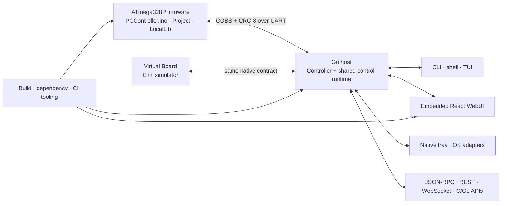

<div align="center"><a href="../README.md"></a></div>

# 🗺️ Repository and file map

This is the first-stop guide for contributors who need to find the authoritative
source for a feature without accidentally editing a generated mirror, a build
artifact, or machine-local state. It maps every maintained directory and file
family in the repository, then points common changes at their code, tests, and
documentation.

> [!IMPORTANT]
> Repository Markdown and tracked source are authoritative. The GitHub Wiki is
> a published mirror, `Tools/Controller/internal/webui/dist/` is a generated
> embedded WebUI snapshot, and `.build/`, `Tools/Controller/bin/`, dependency
> installs, device backups, settings, and secrets are never source.

## 🧭 Find your destination quickly

| You want to change… | Start here | Keep in sync |
|---|---|---|
| MCU behavior, safety, menus, keys, RF, sensors, or outputs | [`PCController.ino`](../PCController.ino), [`Project/`](../Project), [`LocalLib/`](../LocalLib) | Native protocol mirrors, Virtual Board behavior, hardware docs, firmware build |
| Board/host wire frames or opcodes | [`Project/UartProtocol.h`](../Project/UartProtocol.h), [`Tools/Controller/internal/native/`](../Tools/Controller/internal/native), [`Tools/VirtualBoard/include/virtual_board/protocol.hpp`](../Tools/VirtualBoard/include/virtual_board/protocol.hpp) | API contracts, golden tests, capability matrix; these are currently cross-language mirrors and must be reviewed together |
| Public Go API | [`Tools/Controller/controller.go`](../Tools/Controller/controller.go) | `controller_test.go`, C ABI, protocol/API docs |
| CLI, startup, primary ownership, programming commands | [`Tools/Controller/cmd/controller/`](../Tools/Controller/cmd/controller) | Go tests beside the changed file, user docs, command help |
| TUI | [`Tools/Controller/internal/tui/`](../Tools/Controller/internal/tui) | Shared control dispatcher, capability matrix, TUI tests |
| WebUI | [`Tools/Controller/web/src/`](../Tools/Controller/web/src) | Web tests, API types, accessibility/localization, regenerated embedded bundle |
| Native window, tray, hotkeys, notifications, or shell | [`Tools/Controller/internal/hostui/`](../Tools/Controller/internal/hostui), [`Tools/Controller/internal/nativeshell/`](../Tools/Controller/internal/nativeshell) | Platform build-tag implementations and tests, CLI wiring |
| JSON-RPC, REST, WebSocket, discovery, or bridges | [`Tools/Controller/internal/ipcjson/`](../Tools/Controller/internal/ipcjson), [`Tools/Controller/internal/discovery/`](../Tools/Controller/internal/discovery) | [`Tools/Controller/api/`](../Tools/Controller/api), protocol docs, authorization tests |
| Configuration or secret references | [`Tools/Controller/internal/appconfig/`](../Tools/Controller/internal/appconfig), [`Tools/Controller/internal/secretstore/`](../Tools/Controller/internal/secretstore) | Example config, settings UIs, host-configuration guide |
| Firmware build/programming/toolchain | [`Tools/Firmware/`](../Tools/Firmware), [`Tools/Controller/internal/programmer/`](../Tools/Controller/internal/programmer) | Toolchain profile/lock, safe-programming docs, build tests |
| Whole-product build/package | [`Tools/Build/`](../Tools/Build) | Root launchers, dependency locks, CI workflows |
| Hardware-free board simulation | [`Tools/VirtualBoard/`](../Tools/VirtualBoard) | Firmware-facing protocol and shared firmware-control tests |
| CI, release, repository policy | [`.github/workflows/`](../.github/workflows), [`.github/scripts/`](../.github/scripts) | Local equivalent checks and CI/CD docs |
| Product name, icon, banner, or packaged resources | [`Tools/Controller/web/package.json`](../Tools/Controller/web/package.json), [`Tools/Controller/winres/generate_icon.go`](../Tools/Controller/winres/generate_icon.go), [`docs/assets/`](assets) | Generated Go/Win32 metadata, Web public assets, embedded bundle |
| Documentation, Wiki, issue traceability | [`docs/`](.), [`Tools/Controller/docs/`](../Tools/Controller/docs), [`Tools/Audit/`](../Tools/Audit) | Repository link check, Wiki preview, canonical GitHub tracker |

## 🧱 System shape



The Go host is the one primary connection owner. CLI, TUI, WebUI, native
integration, libraries, IPC, and network clients reuse its command dispatcher,
safety policy, snapshot, and event streams instead of owning separate board
definitions.

## 🌳 Top-level tree

```text
PCController/
├─ .github/                 CI workflows, issue/PR templates, repository gates
├─ docs/                    canonical product, operations, and acceptance docs
│  └─ assets/               documentation banner and repository hero artwork
├─ LICENSES/                license texts used by REUSE/third-party notices
├─ LocalLib/                compact reusable AVR drivers and primitives
├─ Project/                 controller-specific firmware domains
│  └─ Firmware/             single-translation-unit runtime fragments
├─ Tools/
│  ├─ Audit/                API, Wiki, prompt/issue traceability helpers
│  ├─ Bootloader/           reproducible Urboot customization
│  ├─ Build/                whole-product build and packaging orchestrator
│  ├─ CommandPlan/          shared command-plan policy
│  ├─ Controller/           Go host, UIs, APIs, resources, and tests
│  ├─ Dependencies/         stable dependency resolver and exact tool locks
│  ├─ Firmware/             firmware build/check/watch/upload orchestrator
│  └─ VirtualBoard/         C++ board simulator and protocol tests
├─ PCController.ino         Arduino sketch entry and firmware composition
├─ PCControllerProject.cpp  includes Project implementations exactly once
├─ PCControllerLocalLib.cpp includes LocalLib implementations exactly once
├─ ProjectConfig.h          compile-time firmware feature/electrical switches
├─ build.cmd / build.sh     portable whole-product launcher pair
├─ firmware.cmd / .sh       portable firmware-tool launcher pair
└─ update-dependencies.*    portable dependency-maintenance launcher pair
```

Root policy files are [`.gitattributes`](../.gitattributes),
[`.gitignore`](../.gitignore), [`LICENSE`](../LICENSE),
[`REUSE.toml`](../REUSE.toml), and
[`THIRD_PARTY_NOTICES.md`](../THIRD_PARTY_NOTICES.md). Do not commit an IDE
directory, local environment file, binary, backup, secret, or generated output
that is excluded by `.gitignore`.

## ⚙️ Firmware source

### Composition and configuration

| Path | Responsibility | Edit rule |
|---|---|---|
| [`PCController.ino`](../PCController.ino) | Includes firmware domains and exposes only `setup()`/`loop()` | Edit lifecycle composition here; keep domain logic in its owning file |
| [`PCControllerProject.cpp`](../PCControllerProject.cpp) | Aggregates `Project/*.cpp` because Arduino does not compile arbitrary nested source automatically | Add each new Project implementation exactly once |
| [`PCControllerLocalLib.cpp`](../PCControllerLocalLib.cpp) | Aggregates `LocalLib/*.cpp` | Add each new LocalLib implementation exactly once |
| [`ProjectConfig.h`](../ProjectConfig.h) | UART rate and hardware/feature compile switches | Change only with memory, electrical, and profile evidence |

The files under [`Project/Firmware/`](../Project/Firmware) are deliberately
included into the sketch's one translation unit so AVR LTO, stack use, and
byte-tight layout remain predictable:

| Fragment | Owns |
|---|---|
| `ControllerConfiguration.inc.h` | compile/runtime configuration assembly |
| `ControllerContext.inc.h` | global controller context and domain instances |
| `ControllerUtilities.inc.h` | shared firmware-only helpers |
| `FrontPanelRuntime.inc.h` | physical keys, pages, editors, and display response |
| `LifecycleRuntime.inc.h` | startup, main service loop, readiness, and reset lifecycle |
| `ProtocolRuntime.inc.h` | UART request dispatch and unsolicited events |
| `RadioRuntime.inc.h` | RF receive, learning, mapping, and key dispatch |
| `SensorRuntime.inc.h` | I²C/OneWire discovery, readings, and optional-module tolerance |

### `LocalLib/`: reusable AVR primitives

| Files | Responsibility |
|---|---|
| `BoardPins.h` | canonical MCU pin assignment |
| `Keys.*`, `ModeManager.h`, `Tasks.*` | low-latency key state, mode ownership, and cooperative scheduling |
| `SevenSegments.*`, `I2cLcd.*` | TM1637 and optional LCD presentation primitives |
| `ShiftRegisters.*` | 74HC165/74HC595-style input/output transport |
| `DallasTemperatureBus.*` | bounded DS18B20/OneWire access |
| `TonePlayer.*`, `pitches.h` | non-blocking notes/melodies and pitch constants |

### `Project/`: controller-specific domains

| File family | Responsibility |
|---|---|
| `UartProtocol.*`, `ControllerEvents.*` | native frame constants, payloads, replies, and device events |
| `EepromLayout.h`, `SettingsStore.*`, `RemoteLearningStore.*` | EEPROM layout, validated settings, RF records, and migrations |
| `RelayController.*`, `MotionDoorPolicy.h`, `SafeResetController.*` | relay interlocks, motion/door decisions, safe reset behavior |
| `PwmController.*`, `PwmExpanderDriver.*` | logical PWM ownership and optional PCA9685 transport |
| `AddressableLeds.*`, `IlluminationController.*`, `StatusLedController.*` | strip, enclosure light, and status/effect rendering |
| `CompactI2c.*`, `Ina219Sensor.*`, `SystemInputs.*`, `TemperatureRoles.h` | shared bus recovery, optional sensors, panel inputs, temperature roles |
| `FrontPanelModel.h`, `BootMelody.*`, `FeedbackMelodies.*` | front-panel state and board-owned audible feedback |
| `MacroQueue.*`, `TransitionMath.h` | deterministic timed operations and bounded transitions |
| `ResetTelemetry.*` | reset-cause/boot-count persistence and reporting |

## 🖥️ Native Go host

[`Tools/Controller/`](../Tools/Controller) is a standalone Go module.
[`controller.go`](../Tools/Controller/controller.go) is its embeddable public
API; implementation packages stay under `internal/` so every executable uses
the same guarded runtime instead of forking behavior.

### Executable entry points

| Path | Produced tool |
|---|---|
| `cmd/controller/` | primary `controller` executable: CLI, TUI, WebUI host, shell, IPC, programming, desktop/tray, and lifecycle wiring |
| `cmd/controller-cabi/` | C-compatible shared-library build entry |
| `cmd/default-assets/` | packaging-only generator for a complete safe-default EEPROM image |
| `cmd/toolchain-resolver/` | isolated firmware dependency resolver; no serial/UI packages |
| `cmd/tui-preview/` | hardware-free TUI rendering/interaction preview |

`cmd/controller/` keeps command-family wiring in named files such as
`board_cli.go`, `device_cli.go`, `firmware_cli.go`, `programming_cli.go`,
`network_cli.go`, and `driver_cli.go`. `primary.go` owns the shared primary
runtime, `host_instance*.go` owns per-user instance coordination,
`native_web_shell.go` owns native WebUI shell integration, and
`runtime_configuration.go` applies watched configuration. Tests are colocated
as `*_test.go`.

### Internal package ownership

| Package | Owns |
|---|---|
| `appconfig` | strict config model, defaults, codecs, validation, hotkeys, integrations, and secret references |
| `artifacts` | immutable SHA-256 artifact store, import/export, download, device capture, update journal, and self-update staging |
| `consolewindow` | local console row/column/font management with platform boundaries |
| `control` | authoritative command dispatcher, snapshots/events, automation, history, menus, displays, RF, macros, and programming lifecycle |
| `defaultassets` | verified optional firmware/EEPROM images embedded at package time |
| `discovery` | mDNS/DNS-SD and SSDP host discovery without granting access |
| `hostbridge` | configured hotkeys, notifications, buzzer/status mirrors, webhooks, and host lifecycle integration |
| `hostfacts` | fixed, bounded read-only host-fact catalog; never caller-supplied WQL |
| `hostmenu` | host-owned front-panel menu definitions and execution |
| `hostos` | allowlisted brightness, volume, battery, monitor, virtual-key, and power platform adapters |
| `hostui` | desktop/tray/window/hotkey/notification actions and Win32 implementations |
| `integrationproxy` | same-origin proxy to explicitly configured integration roots |
| `ipcjson` | authenticated JSON-RPC, REST, WebSocket, WebUI mounting, routes, and policy |
| `link` | serial/TCP discovery, HELLO authentication, and reconnecting session |
| `localdevice` | typed bounded local-network device integration contract |
| `native` | COBS/CRC frames, wire payloads, opcodes, settings/status/event codecs |
| `nativeshell` | native menu/shell command catalog and OS event integration |
| `netpolicy` | proxy/no-proxy and outbound URL/network-scope validation |
| `pcspeaker` | platform PC-speaker renderer and guarded fallback |
| `portowner` | bounded COM-owner attribution and guarded process actions |
| `ports` | serial enumeration and stable device metadata |
| `productidentity` | stable technical IDs plus configurable presentation identity |
| `programmer` | toolchain bootstrap, compile, backup, bootloader, flash/EEPROM, verify, restore, and storage |
| `releaseplane` | GitHub/workflow/manifest discovery and staged release metadata |
| `script` | deterministic line-oriented batch scripts |
| `secretstore` | environment and OS-vault references without a plaintext secrets file |
| `sessionsnapshot` | bounded diagnostic/support snapshot and atomic persistence |
| `shell` | line editor, command catalog, history, completion, and dispatch |
| `tui` | terminal pages, navigation, settings, console, and shared runtime projection |
| `webui` | embedded production bundle handler and deterministic portable export |
| `wsrelay` | authenticated remote WebSocket relay/bridge |

Platform files use Go build suffixes/tags (`*_windows.go`, `*_other.go`). Add a
portable interface and test first, then implement each supported platform;
never make a Windows-only symbol the shared definition.

## 🌐 WebUI, API, and native resources

### WebUI source

[`Tools/Controller/web/`](../Tools/Controller/web) is the React/TypeScript/Vite
application:

| Path | Responsibility |
|---|---|
| `src/app.tsx`, `src/main.tsx`, `src/views.tsx` | app composition, routing, and primary views |
| `src/components.tsx`, `src/styles.css` | reusable accessible components and canonical visual system |
| `src/workbench.tsx`, `src/advanced-workbench.tsx` | board-control workbenches |
| `src/data-workspace.tsx`, `src/typed-collection*.tsx` | typed data collection/import/export workspaces |
| `src/api.ts`, `src/types.ts`, `src/*-api.ts` | transport and typed API models |
| `src/telemetry-chart.tsx`, `src/event-collection.tsx` | live measurements and event presentation |
| `src/hotkey*`, `src/rf-guided-workflow.tsx`, `src/updates-view.tsx` | specialized configuration/workflows |
| `src/i18n.ts`, `src/vazirmatn.woff2` | English/Persian, LTR/RTL, and bundled font source |
| `src/*.test.ts`, `src/*.test.tsx` | Vitest behavior, safety, routing, localization, and accessibility contracts |
| `public/` | static source favicon, PWA manifest, service worker, theme bootstrap, and portable controller config |
| `package.json`, `package-lock.json`, `vite.config.ts` | canonical product metadata, exact web dependencies, build/test configuration |

Vite writes to
[`Tools/Controller/internal/webui/dist/`](../Tools/Controller/internal/webui/dist).
That directory is tracked so Go's `embed` can package a deterministic WebUI,
but every file inside it is generated. **Edit `web/src/` or `web/public/`, run
the Web build, and review the complete regenerated `dist/`; never patch a
hashed bundle directly.**

### API contracts

| Path | Responsibility | Generated? |
|---|---|:---:|
| `Tools/Controller/api/openapi.json` | REST contract | source catalog |
| `Tools/Controller/api/asyncapi.json` | event/WebSocket contract | source catalog |
| `Tools/Controller/api/jsonrpc.schema.json` | JSON-RPC methods, errors, and capabilities | source catalog |
| `Tools/Controller/api/reference.html` | offline combined reference | yes; run `Tools/Audit/generate-api-reference.mjs` |
| `Tools/Controller/docs/Protocol-and-Network-API.md` | human protocol/network guide | no |
| `Tools/Controller/docs/C-Library-API.md` | C ABI lifecycle and ownership | no |
| `Tools/Controller/docs/Control-Surface-Capability-Matrix.md` | feature parity across every surface | no |

### Product identity and assets

| Canonical input | Derived/related output | Rule |
|---|---|---|
| `Tools/Controller/web/package.json` product fields | `internal/productidentity/metadata_gen.go`, `winres/winres.json`, build labels, Web compile constants | Run `internal/productidentity/generate.mjs`; do not edit generated Go metadata |
| `Tools/Controller/winres/generate_icon.go` geometry/palette | `winres/icon.png`, `winres/icon.ico`, packaged executable icon, browser ICO | Generator is the raster/ICO source of truth |
| `Tools/Controller/web/public/favicon.svg` | browser SVG mark and Wiki icon | Keep geometry/colors aligned with the icon generator |
| `docs/assets/pccontroller-hero.svg` | repository README hero | Maintained SVG; keep the same mark and palette |
| `docs/assets/doc-banner.svg` | documentation headers and Wiki banner | Maintained SVG; keep the same mark and palette |
| `winres/icon-{connected,offline,paused,reconnecting}.ico` | native tray states | Reviewed state-specific native assets |

[`Tools/Controller/winres/`](../Tools/Controller/winres) also contains the
Windows resource manifest. Generated `.syso` files are build output and must
not be committed.

## 🧪 Virtual Board

[`Tools/VirtualBoard/`](../Tools/VirtualBoard) is the hardware-free C++ model:

| Path | Responsibility |
|---|---|
| `include/virtual_board/` | public simulator hardware, protocol, TCP, and board interfaces |
| `src/hardware.cpp` | simulated pins, clocks, EEPROM, and peripherals |
| `src/protocol.cpp` | native framing/opcode mirror |
| `src/virtual_board.cpp` | board state and command behavior |
| `src/tcp_server.cpp`, `src/main.cpp` | TCP transport and executable entry |
| `tests/arduino_mock/` | AVR/Arduino headers used by host-native firmware tests |
| `tests/firmware_controls_test.cpp`, `reset_telemetry_test.cpp` | selected real firmware-domain tests |
| `tests/uart_protocol_test.cpp`, `smoke_client.cpp`, `test_main.cpp` | wire and end-to-end simulator tests |
| `CMakeLists.txt`, `CMakePresets.json` | portable configure/build/test definitions |

`Tools/VirtualBoard/.build/` and `virtual-mcu-eeprom.bin` are local generated
state. Delete them freely when the simulator is stopped; never commit them or
mistake simulator success for loaded-hardware evidence.

## 🛠️ Build, dependency, release, and audit tooling

| Area | Authoritative files | Purpose |
|---|---|---|
| Whole-product build | `Tools/Build/build.mjs`, `go-tests.mjs`, `product-metadata.mjs`, `presentation.mjs` | deterministic firmware/Web/Go build, validation, resources, packaging, manifests |
| Shared command policy | `Tools/CommandPlan/controller-command.mjs` | one board/artifact/Controller command plan used by build and firmware tooling |
| Firmware lifecycle | `Tools/Firmware/firmware.mjs` | build, check, watch, explicit upload/bootloader delegation |
| Firmware target policy | `Tools/Controller/toolchain-profile.json` | canonical FQBN, MCU, clock, capacities, stable dependency constraints |
| Exact firmware lock | `Tools/Controller/toolchain-lock.json` | resolved core/library/CLI/Urboot/Go versions, URLs, hashes |
| Generated runtime target | `internal/programmer/toolchain_policy_gen.go` | generated from profile + lock; do not edit |
| Host-tool policy/lock | `Tools/Dependencies/dependency-policy.json`, `resolved-tools-lock.json` | Node/UPX/go-winres/compiler/Action policy and immutable resolution |
| Dependency updater | `Tools/Dependencies/update.mjs`, `network.mjs`, `pr-plan.mjs` | stable resolution, proxy-aware fetch, validation, deterministic PR plan |
| Custom bootloader | `Tools/Bootloader/Urboot-Custom/` | pinned upstream source manifest, patch, progress backend, reproducible build |
| API generator | `Tools/Audit/generate-api-reference.mjs` | validates catalogs and regenerates offline reference |
| Wiki publisher | `Tools/Audit/publish-wiki.mjs` | validates/copies canonical Markdown into branded Wiki pages |
| Requirement sync | `Tools/Audit/sync-github-requirements.mjs` | idempotent issue/label/hierarchy/prompt-provenance synchronization |
| Private prompt extractor | `Tools/Audit/extract-user-turns.mjs` | local audit input; never publishes raw transcripts or secrets |

Node tool tests live next to their implementation as `*.test.mjs`. Lock files
are reviewed source evidence: update them through the owning resolver instead
of editing versions/hashes by hand.

### CI and repository automation

| Path | Responsibility |
|---|---|
| `.github/workflows/build.yml` | flagship multi-product build matrix |
| `firmware.yml`, `host.yml`, `virtual-board.yml` | reusable focused gates |
| `repository-health.yml`, `codeql.yml` | source policy, links, generated drift, security analysis |
| `release.yml` | validated prerelease/release packaging and publication |
| `deploy-avr.yml` | protected, explicit physical deployment boundary |
| `update-dependencies.yml` | scheduled/manual dependency resolution and validated PR lifecycle |
| `.github/scripts/repository-check.mjs` | required files, links, privacy, Action pins, generated API check |
| `.github/scripts/repository-policy.mjs` | shared source/privacy/generated-path policy |
| `.github/scripts/assert-*-defaults.mjs` | firmware/host/product default consistency |
| `.github/scripts/package-directory.mjs` | deterministic archive staging |
| `.github/scripts/release-showcase.mjs` | release chooser, notes, and manifest |
| `.github/scripts/security-config-check.mjs` | workflow and security-configuration invariants |
| `.github/ISSUE_TEMPLATE/`, `pull_request_template.md` | contributor intake and evidence checklists |

## 📚 Documentation and Wiki ownership

| Location | Contents |
|---|---|
| [`docs/README.md`](README.md) | canonical documentation navigation |
| `docs/Getting-Started-and-Operations.md` | build, run, connect, and operate |
| `docs/Front-Panel-and-Menus.md` | keys, gestures, pages, display, EEPROM menu behavior |
| `docs/Hardware-Initialization-and-Tuning.md` | wiring, buses, startup, calibration, physical checks |
| `docs/Host-Configuration-and-Integrations.md` | host schema, secrets, UI, hotkeys, notifications, bridges |
| `docs/Toolchain-and-Safe-Programming.md` | dependencies, backup, bootloader/flash, recovery |
| `docs/Memory-and-Feature-Tradeoffs.md` | AVR budgets and host/firmware ownership decisions |
| `docs/CI-CD-and-Releases.md` | checks, artifacts, manifests, releases, deployment boundary |
| `docs/Project-Checklist.md` | current acceptance evidence and honest remaining gaps |
| `docs/Requirements-Backlog.md` | generated public issue map; update through requirement sync |
| `docs/Local-Library-Variant-Comparison.md` | reviewed helper variants and retained/excluded behavior |
| `Tools/*/README.md` | maintainer detail for each build/tool/runtime domain |
| `Tools/Controller/docs/` | host/API/UI-specific contracts |

> [!NOTE]
> Edit repository Markdown, not the Wiki clone. Preview the generated Wiki with
> `node Tools/Audit/publish-wiki.mjs --preview`; publish it only after the source
> change is merged with `node Tools/Audit/publish-wiki.mjs --apply`.

When behavior changes, update the owning guide, capability matrix, tests, and
acceptance evidence in the same pull request. A successful software gate is not
evidence that a physical relay, mechanism, programmer, or optional module was
tested.

## 🗄️ Runtime configuration, data, secrets, and portability

None of the paths in this section belongs in Git. Query the active locations
instead of assuming them:

```console
controller config path config
controller config path data
controller config open config
controller config open data
```

### Per-user configuration

| Platform | Default `config.json` |
|---|---|
| Windows | `%AppData%\PCController\config.json` |
| Linux | `$XDG_CONFIG_HOME/PCController/config.json`, otherwise `~/.config/PCController/config.json` |
| macOS | `~/Library/Application Support/PCController/config.json` |

`--config FILE` has command-line precedence; `PCCONTROLLER_CONFIG` supplies an
environment override. The file holds host preferences, selectors, menus,
automations, integration definitions, and secret *references*. It may be
exported deliberately, but review device names, endpoints, executable paths,
and local policy before importing it on another machine. Never commit it.

### Per-user application data

| Platform | Default data root |
|---|---|
| Windows | `%LocalAppData%\PCController` |
| Linux | `$XDG_DATA_HOME/pccontroller`, otherwise `~/.local/share/pccontroller` |
| macOS | `~/Library/Application Support/PCController` |

`PCCONTROLLER_DATA_DIR` may override the data root with an absolute path.
Important children are:

| Relative path | Contents | Portability |
|---|---|---|
| `backups/operations/` | transaction manifests and backup evidence | exportable; preserve with the matching board/artifact |
| `backups/firmware/sha256/` | immutable firmware blobs | content-addressed and exportable |
| `backups/board-settings/sha256/` | immutable board settings/EEPROM records | board-sensitive; export deliberately |
| `artifacts/` | imported/current firmware, EEPROM, flash, and host artifacts | content-addressed; use app/API import/export rather than copying live files |
| `tools/toolchain/` | managed Arduino CLI/core/library workspace | machine/platform-specific and reproducible from locks |
| `drivers/usbasp/` | reviewed USBasp driver package/download state | Windows/machine-specific |
| `state/last-session.json` | last bounded diagnostic snapshot | machine/session-specific |
| `state/programming-recovery-*.json` | durable interrupted-programming marker | do not delete until the matching recovery is resolved |
| `timeline.jsonl`, `measurements.jsonl`, `logs/` | configured activity, telemetry, and diagnostics | optional user data; sanitize before sharing |

Arduino compile scratch data defaults under the platform user cache at
`PCController/ArduinoBuild` and can be overridden with
`PCCONTROLLER_ARDUINO_CACHE`. It is disposable and not a backup.

### Secrets and board-owned state

- `env:NAME` references read the current process environment; the value is not
  copied into `config.json`.
- `os:NAME` references use the platform credential vault where available; vault
  values are machine/user scoped and must be re-provisioned after a config sync.
- There is no supported plaintext secrets file. `.env`, keys, certificates,
  tokens, and credentials are ignored and must not be committed.
- MCU EEPROM owns board settings, board name, learned RF records/mappings, and
  reset telemetry. Host config/data is not a substitute for a verified EEPROM
  backup, and clearing host settings does not erase the board.

<details>
<summary><strong>Portable versus machine-specific checklist</strong></summary>

- [x] Source, documentation, locks, profiles, schemas, and tests belong in Git.
- [x] Reviewed configuration can be exported/imported without its secret values.
- [x] Content-addressed board/host artifacts can be served, fetched, and synced
  through the authenticated artifact API.
- [ ] OS-vault secrets must be provisioned separately on each user/machine.
- [ ] COM names, window settings, paths, drivers, toolchains, caches, and live
  recovery markers must not be assumed portable.
- [ ] A board EEPROM backup must be matched and verified against that board.

</details>

## 🧬 Source versus generated matrix

| Edit this source | Regenerate/check this output | Never hand-edit |
|---|---|---|
| `Tools/Controller/web/src/`, `web/public/` | `npm run typecheck`, `npm test`, `npm run build` | `internal/webui/dist/**` |
| `Tools/Controller/web/package.json` product metadata | `node internal/productidentity/generate.mjs` | `internal/productidentity/metadata_gen.go`; generated fields in `winres.json` |
| `toolchain-profile.json`, resolved `toolchain-lock.json` | `node internal/programmer/generate-toolchain-policy.mjs` | `internal/programmer/toolchain_policy_gen.go` |
| `Tools/Controller/api/*.json` | `node Tools/Audit/generate-api-reference.mjs` | `Tools/Controller/api/reference.html` |
| `docs/**/*.md`, `Tools/*/README.md` | `node Tools/Audit/publish-wiki.mjs --preview` | Wiki clone/pages |
| icon generator and reviewed SVG sources | normal host build/resource checks | `.syso`, loose build icons, packaged resources |
| firmware and safe EEPROM defaults | firmware/host build manifests | `.hex`, `.eep`, `.elf`, `.map`, `.lst` |
| Go/C++/TypeScript/Node source | owning build/test command | `.build/`, `bin/`, `node_modules/`, Virtual Board EEPROM |

## ✅ Change-to-check matrix

| Change | Minimum hardware-free checks |
|---|---|
| Markdown/docs/Wiki publisher | `node .github/scripts/repository-check.mjs`; `node Tools/Audit/publish-wiki.mjs --preview` |
| Go host/internal package | from `Tools/Controller`: `go test ./...` and `go vet ./...` |
| WebUI | from `Tools/Controller/web`: `npm ci`, `npm run typecheck`, `npm test`, `npm run build` |
| Firmware | `firmware.cmd build` and `firmware.cmd check` (or POSIX equivalents) |
| Virtual Board | CMake `release` configure/build plus `ctest --preset release` |
| Build/dependency/audit Node tool | the adjacent `*.test.mjs`, then the owning dry-run/check command |
| Protocol/API contract | firmware/Go/Virtual Board tests plus `generate-api-reference.mjs --check` |
| Whole-product or release path | `build.cmd --all --clean --no-upx` plus repository-health checks |

Use the relevant physical acceptance checklist after, not instead of, these
checks. Never attach a device merely to satisfy a source-only change.

## 🔎 Finding every individual file

This map groups files by ownership so it remains useful as the repository
grows. For an exact current manifest, ask Git rather than a stale hand-written
list:

```console
git ls-files
git ls-files Project LocalLib
git ls-files Tools/Controller/internal
git ls-files "**/*_test.go" "**/*.test.ts" "**/*.test.tsx" "**/*.test.mjs"
git status --short --ignored
```

Use `rg --files` to include untracked non-ignored files while investigating,
and `rg -n "symbol or phrase"` to find every definition and consumer. Before
creating a new registry, constant set, command dispatcher, or platform
abstraction, search the entire repository and extend the existing owner.

<p align="center"><a href="README.md">Documentation hub</a> · <a href="../README.md">PCController main page</a></p>
