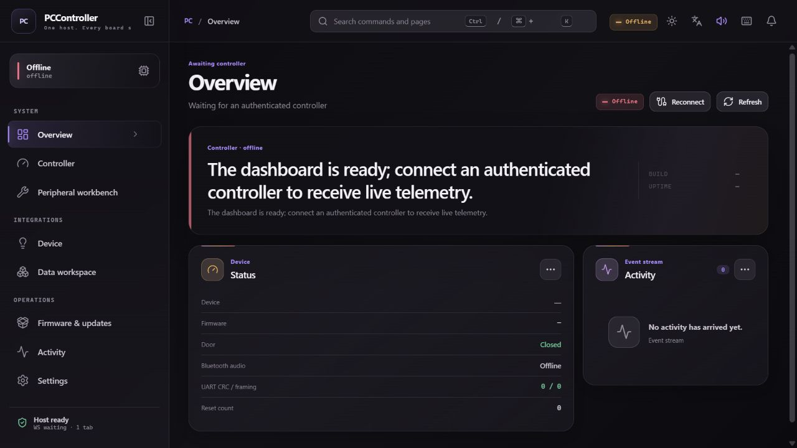

# Alpha unauthenticated UI proof

Issue #148 is authoritative for the immediate alpha: application
authentication and capability authorization are disabled. Browser-origin and
listener controls remain active, URL credentials are rejected, and optional
outbound bearer references exist only to upgrade an older auth-on peer.

## Historical failure

The image below is retained only as before-state evidence. It shows the old,
incorrect authentication onboarding UI and must not be read as current product
guidance.

## Source-level acceptance

The current source and regression tests require:

- `GET /api/ui-config` reports `auth_required: false` in alpha.
- IPC, HTTP RPC, WebSocket, and Socket.IO requests do not require application
  credentials.
- Browser requests still obey the configured Origin allowlist, and credentials
  in URL query parameters remain rejected.
- An unauthenticated WebUI renders no board build, uptime, status, telemetry,
  device card, control, event, placeholder, or stale value before a connected
  peer advertises the relevant capability and returns authoritative state.
- A transport gap clears stale board state. Automatic bounded reconnect remains
  enabled, and activating the disconnected indicator starts an immediate real
  reconnect attempt.

The previous `auth-dashboard-after.png` was removed because it still displayed
**Authentication required** and therefore was not valid after-state evidence.

## Deployment evidence

An exact-main deployed screenshot is intentionally pending. It must be captured
after this change is merged and deployed, and must show the authoritative alpha
state without any token prompt or unadvertised board values. Source-level tests
and generated-contract checks are evidence for this pull request; they are not
substitutes for that post-deployment screenshot.
