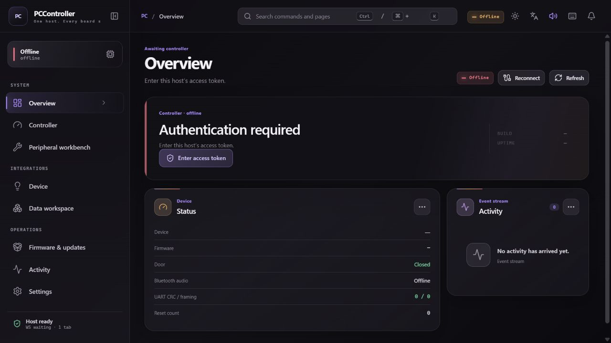

# Authentication onboarding proof

The dashboard first reuses any valid session token and reconnects without a
prompt. It shows the authentication action only after the host reports that
authentication is required and the automatic attempt has no usable token or
was rejected.

## Before

The previous dashboard repeated a long, vague status and offered no direct
recovery action.

## After

The deployed dashboard states the exact condition, asks for the exact value,
and exposes one recovery action.

## Operator flow

1. Select **Enter access token**. The app opens **Settings → Security**.
2. Obtain the access token through the controller host's approved secret-store
   workflow. Do not paste the value into logs, issue comments, URLs, or chat.
3. Paste it into **Session access token** and select **Apply**.
4. The app stores the token only for the browser session, reconnects
   automatically, and replaces the authentication card with live state.
5. If the host rejects the token, the same password field remains available;
   the UI does not expose or guess the confidential value.

## Runtime evidence

- The action was clicked against the deployed Linux host and navigated from
  `#/dashboard` to `#/settings`.
- The target view exposed the password textbox named **Session access token**
  and the disabled-until-input **Apply** button.
- `server:8787` is healthy. Its configured `cafe-pc` bridge reaches the peer,
  but the peer returns HTTP 401 because the two hosts currently use different
  secret-store tokens. Completing that final pairing requires the café token
  through the password form; bypassing or extracting it would defeat the
  authentication boundary this flow is meant to preserve.
